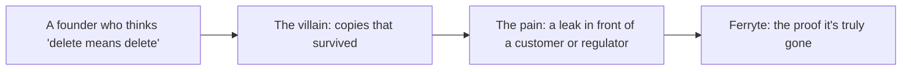
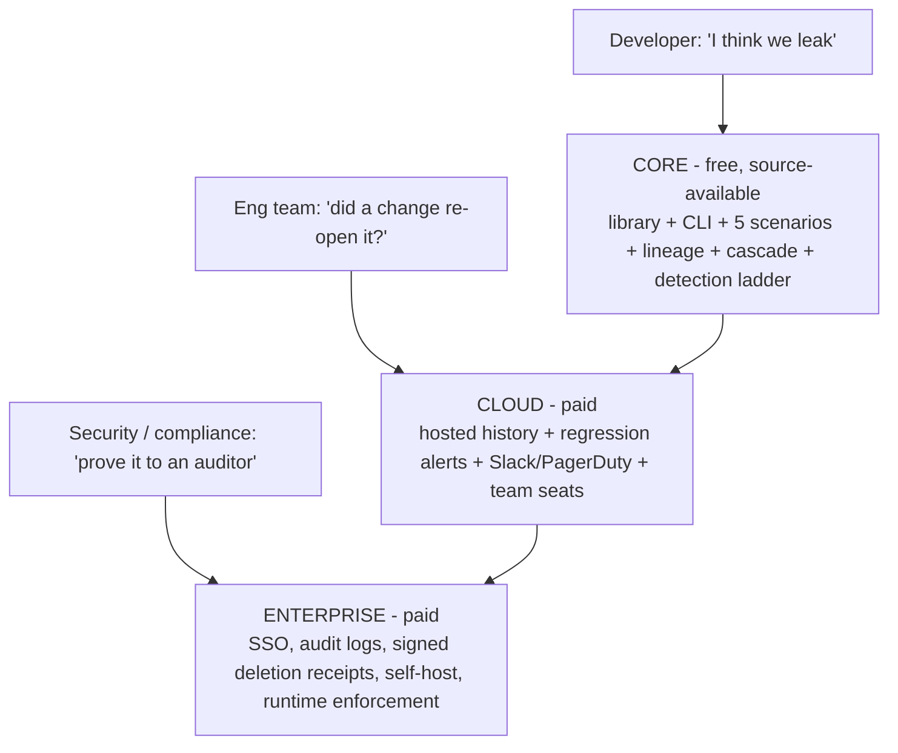
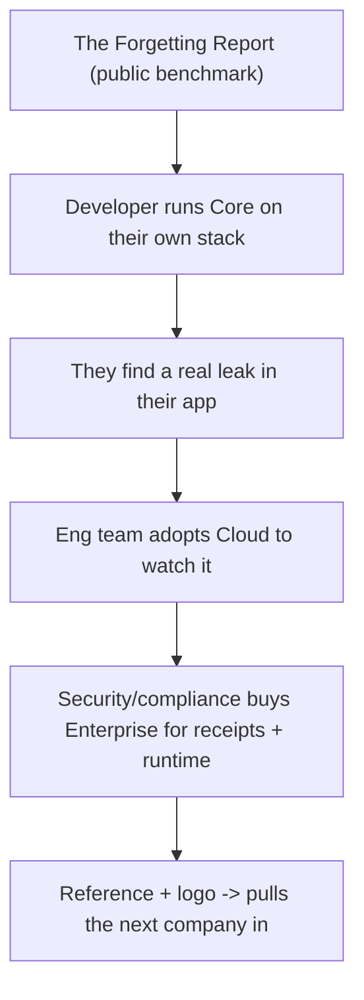
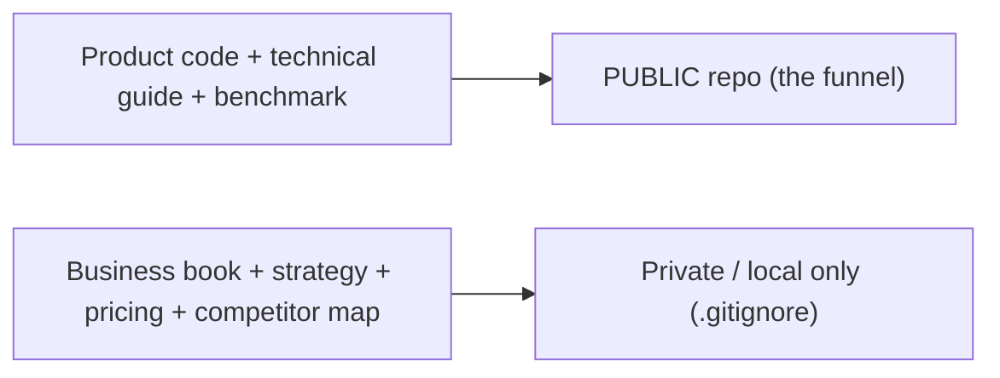

# Ferryte: The Business Book

### The money, the market, and the pitch — explained simply, sold like it matters

> **CONFIDENTIAL — internal only.** This book contains pricing strategy, target
> accounts, competitive teardown, and go-to-market plans. It is deliberately **not**
> pushed to the public repo (it's in `.gitignore`). The public, technical companion is
> *Ferryte: The Complete Guide*.

**Codex-expanded internal edition.** I preserved the original business book and every diagram
intact, then added more detail on pricing, sales motion, design partners, competitive traps,
trust marks, enterprise objections, and execution risks. Any paragraph marked **Personal note
(Codex)** is my own commentary layered on top of the strategy, including places where I would
soften or sharpen the claim before using it with customers.

---

**How to read this book**

Same two rules as the technical guide: **plain words first**, and **a picture for every
hard idea**. You can hand this to someone who has never run a company and they'll finish
it understanding exactly how Ferryte makes money, who buys it, and how we'd sell it.

This book has a special section — **Part 9, "The Keynote"** — written as if Steve Jobs
were on stage selling Ferryte, start to finish. If you only read one part out loud, read
that one.

---

## Table of contents

- **Part 1 — The one idea (what we actually sell)**
- **Part 2 — The enemy (the villain that makes people buy)**
- **Part 3 — The business model: open core, decided and locked**
- **Part 4 — The three tiers, in plain words**
- **Part 5 — The money: pricing philosophy (decided vs. still open)**
- **Part 6 — Who we sell to (and who we don't)**
- **Part 7 — The competition and why we win**
- **Part 8 — Go-to-market: the motion, start to end**
- **Part 9 — THE KEYNOTE: how Steve Jobs would sell Ferryte**
- **Part 10 — The room: every objection and the answer**
- **Part 11 — How we ship the code without giving away the company**
- **Part 12 — The long game: the moat and what winning looks like**
- **Part 13 — The decisions we've locked (don't relitigate without cause)**
- **Part 14 — Glossary of business terms**
- **Codex additions throughout** — packaging detail, GTM checklists, sales assets, personal
  notes, and source-check caveats.

---

# Part 1 — The one idea (what we actually sell)

Here is the whole business in one sentence:

> **We sell proof that AI forgot.**

Not software. Not a dashboard. **Proof.** When a company tells its customers, a regulator,
or its own board "yes, we deleted that data," Ferryte is the thing that makes that sentence
*true* — and provable.

> **In plain words:** every company with an AI is going to be asked, "did you really delete
> my data?" Right now their honest answer is "we think so." We sell the difference between
> "we think so" and "here's the proof."

Steve Jobs never sold a music player with "5GB of storage." He sold **"1,000 songs in your
pocket."** Same product, completely different sentence. Ours:

- **Not:** "a Python library that instruments memory backends and runs forgetting scenarios."
- **Yes:** **"When you hit delete, we make sure it's actually gone — everywhere it hid."**

Memorize the second sentence. It's the company.

## 1.1 The sharper business thesis

Ferryte is not merely selling "AI memory testing." It is selling a new control that enterprise
AI buyers will eventually expect:

> **A deletion-control plane for agent memory.**

That phrase matters internally because it explains why the company can become bigger than a
single CLI test. A control plane is where teams define policy, see status, enforce rules, and
produce evidence. Core proves the control is needed. Cloud makes it continuous. Enterprise
makes it enforceable and auditable.

The business wedge is therefore:

1. **Start with proof.** "Did the AI forget?"
2. **Expand to monitoring.** "Did it stay forgotten after code changed?"
3. **Expand to enforcement.** "Can deleted-lineage memories be blocked live?"
4. **Expand to evidence.** "Can I hand proof to a security reviewer, customer, or regulator?"

> **In plain words:** the first product is a test. The business is the system of record for
> whether agent memory is safe to use.

## 1.2 Why now

The timing works because four curves are crossing:

| Curve | What changed | Why it creates urgency |
|---|---|---|
| AI agents | products now remember users across sessions | deletion has more places to fail |
| Enterprise adoption | AI vendors sell into regulated buyers | questionnaires demand evidence |
| Privacy operations | deletion rights are normal customer expectations | "trust us" is no longer enough |
| Memory stack fragmentation | teams use Mem0, Zep, vector DBs, caches, custom summaries | no single vendor can verify all copies |

The best startup markets have a new capability, a new risk, and a new budget owner. Ferryte has
all three: agent memory, derived-memory leakage, and security/compliance buyers who already pay
for evidence.

**Personal note (Codex):** I would use "proof" in the headline, but internally I would define
the category as **agent memory assurance** or **agent memory correctness**. "Proof that AI
forgot" is memorable; "memory assurance" is the durable budget category.

---

# Part 2 — The enemy (the villain that makes people buy)

Great products are sold against a villain. The villain here is simple and scary:

> **Data that won't die.**

You told the AI to forget. It didn't. It quietly kept copies — in summaries, notes,
number-codes, caches — and it'll hand them back to the wrong person at the worst possible
time: during a security review, after a "delete my account" request, in front of a regulator,
or in another customer's chat window.

Why this villain is perfect to sell against:

1. **It's invisible.** Nobody can see it until it bites. Fear of the invisible sells.
2. **The vendors admit it.** AWS and Zep document it in their own docs. We don't argue —
   we quote them.
3. **It's getting bigger every day.** Every new AI feature stores more memory, in more
   places. The villain grows while everyone looks away.
4. **The cost of being wrong is catastrophic and personal.** A cross-tenant leak doesn't
   just cost money; it ends the deal, makes the news, and someone gets fired.

> **In plain words:** we're not selling a vitamin ("nice to have"). We're selling a smoke
> detector for a fire most companies don't know is already smoldering in their walls.



## 2.1 The pain ladder

Not every buyer feels the villain equally. The urgency climbs in levels:

| Pain level | What they say | What they need | Likely buyer |
|---|---|---|---|
| Curiosity | "Could this happen to us?" | Core benchmark/demo | developer/founder |
| Anxiety | "A prospect asked how deletion works." | report + CI test | eng lead |
| Active deal risk | "This security review blocks revenue." | Cloud history + evidence packet | CTO / security |
| Incident | "A customer saw data they shouldn't." | blast radius + remediation proof | exec + legal |
| Regulated enterprise | "We need signed, repeatable controls." | Enterprise receipts + runtime enforcement | CISO / compliance |

This matters because the sales motion should not treat every lead the same. A curious developer
gets docs and a fast local win. A blocked enterprise deal gets founder attention and a custom
evidence package.

## 2.2 The buying trigger script

The trigger question is:

> "When a customer asks you to delete memory, do you verify the summaries, extracted facts,
> vector indexes, and caches that were derived from it?"

If the buyer pauses, Ferryte has entered the room. The next question:

> "Would it help if we ran a canary against your actual delete path and gave you a report by
> Friday?"

That is a sharper first meeting than a generic demo. It creates a concrete before/after.

---

# Part 3 — The business model: open core, decided and locked

We made this decision and **locked it** (it's not parked for later). The model is
**open core**: give away a powerful, readable core; charge for the hosted and enterprise
layers on top. The same shape that built **Sentry, HashiCorp, and CockroachDB**.

The one-line version:

> Free, open, auditable **detection** (the front door) → paid, closed **continuous +
> runtime + attested** forgetting (the revenue). Charge sooner via Cloud; never touch the
> free tier.

The four locked decisions:

1. **The detection engine stays free and source-available (BSL 1.1).** It's the funnel, the
   benchmark's credibility, and an enterprise auditability selling point. (More on BSL in
   Part 11.)
2. **Make money via paid Cloud, sooner** — *not* by paywalling detection. The money is in
   *continuous + runtime + attested* forgetting, where high-revenue startups actually feel
   the pain.
3. **Cloud + Enterprise tiers stay fully closed-source** — that's where the hardest IP and
   the real value live.
4. **Time-box the *Cloud* free window, not the core.** Design partners get Cloud free ~5–6
   months; after the cohort, Cloud is paid. **Core detection is free forever** as the wedge.

> **In plain words:** the free tool isn't charity — it's the front door. People walk in
> through the free thing, and some walk out the paid door. We never lock the front door,
> because a security tool nobody can read or run never gets adopted in the first place.

**Why give away the best part?** Because in security, *trust is the product*, and you can't
trust what you can't read. A free, auditable core is what earns the right to sell the paid
layers. Locking it would kill the funnel and the credibility at the same time.

## 3.1 Open core: the fine print that matters

The words matter here:

- **Source-available** means customers can read and run the code under license terms.
- **Open source** usually means OSI-style open-source freedoms. BSL is not the same thing while
  the commercial restriction is active.
- **Fair source / delayed open** is the broader strategic family: readable now, commercially
  protected now, converts later.

For customer trust, the important sentence is:

> "Core is auditable and free to self-host; commercial hosting and enterprise control-plane
> features are paid."

That is clearer than arguing about the philosophy of open source in a sales call.

**Personal note (Codex):** I would avoid saying "open-source the tool" when speaking precisely.
Say **source-available Core under BSL, converting to Apache 2.0 after the change date**. It is
less romantic, but it prevents smart engineers from correcting you and derailing the pitch.

## 3.2 What belongs in Core vs Cloud vs Enterprise

A clean open-core company draws the line by **workflow value**, not by artificially crippling
the free tool.

| Capability | Core | Cloud | Enterprise |
|---|---:|---:|---:|
| Run local scenarios | Yes | Yes | Yes |
| Lineage + cascade | Yes | Yes | Yes |
| Local HTML/JSON reports | Yes | Yes | Yes |
| Hosted run history | No | Yes | Yes |
| Regression alerts | No | Yes | Yes |
| Team permissions | No | Yes | Yes |
| Evidence packets over time | Manual | Yes | Yes |
| SSO / SCIM | No | No or limited | Yes |
| Signed deletion receipts | No | Optional later | Yes |
| Self-hosted control plane | No | No | Yes |
| Runtime blocking | No | No | Yes |
| Custom adapter SLA | No | Maybe | Yes |

> **In plain words:** Core proves the leak. Cloud remembers and alerts. Enterprise governs and
> blocks.

---

# Part 4 — The three tiers, in plain words



| Tier | Who it's for | What it adds | Status |
|---|---|---|---|
| **Core** | Individual developers | The whole detection engine, free to run in production | **Shipped** |
| **Cloud** | Engineering teams | Remembers history, alerts you the moment a leak *re-opens* | In development |
| **Enterprise** | Security / compliance | Signed legal-grade "we forgot it" receipts, SSO, self-host, runtime blocking | Roadmap |

The genius of the split: **each tier sells to a different person in the same company**, so
they don't cannibalize each other.

- The **developer** finds Core, runs it, sees the leak. (Bottom-up adoption.)
- The **eng team** needs Cloud to know if a code change *re-opened* a leak nobody's
  watching. (Recurring value.)
- The **security/compliance buyer** needs Enterprise to hand a regulator a signed receipt
  and to *block* leaks in production. (Big budget, top-down.)

> **In plain words:** the free version proves the problem and runs the test. Cloud watches
> it forever and shouts when it breaks. Enterprise gives the signed paperwork and the live
> guard a big company demands. Three doors, three buyers, one building.

## 4.1 The packaging rule

Each tier should have one sentence:

- **Core:** "Find out if your agent forgets."
- **Cloud:** "Know when forgetting regresses."
- **Enterprise:** "Prove and enforce forgetting across the company."

The product page should not list every feature with equal weight. It should make the upgrade
moment obvious:

1. A developer upgrades to Cloud when the leak is not a one-time problem anymore.
2. A team upgrades to Cloud when multiple services and branches need history.
3. A company upgrades to Enterprise when evidence and runtime policy become board/customer
   concerns.

## 4.2 Suggested tier names

The current Core / Cloud / Enterprise names are clear. If you ever want more branded names:

| Plain name | Possible branded name | Risk |
|---|---|---|
| Core | Ferryte Core | safest |
| Cloud | Ferryte Watch | clearer value, less generic |
| Enterprise | Ferryte Control | strong, but may imply broader governance |

**Personal note (Codex):** I would keep **Core / Cloud / Enterprise** until the product is
pulling customers. Fancy names create internal satisfaction before market evidence. Boring
names sell faster.

---

# Part 5 — The money: pricing philosophy (decided vs. still open)

**What's decided (locked):**

- **Core is free forever.** No paywall on anything Core does today. Ever.
- **Cloud is where we charge first**, and we **pull it forward** — launch paid Cloud sooner
  rather than waiting for a perfect Enterprise suite.
- **Design partners get Cloud free for ~5–6 months**, then it converts to paid. We earn the
  right to charge by being load-bearing first.
- **Don't turn on billing until ~5 teams genuinely rely on Cloud.** First become essential,
  then charge.
- **Enterprise is sold, not self-serve** — it's signed receipts + SSO + self-host +
  runtime, the things a security org pays real money for.

**What's deliberately still open (we'll decide later, with data):**

- The **exact dollar figures** for Cloud seats / tiers.
- The **Enterprise contract shape** (per-seat vs. platform vs. usage).
- Billing mechanics and the precise free-window cutoff.

> **In plain words:** we've locked *how* we make money (free core → paid Cloud → paid
> Enterprise) and *when* we start charging (once teams depend on us). We have **not** yet
> picked the price tags — and that's on purpose, because you set prices once you see what
> customers will pay, not before.

**Pricing instinct (not yet locked, just the gut):** price Cloud where an eng team feels it's
cheaper than one engineer spending a day chasing a leak — and price Enterprise where it's
trivially cheaper than one failed audit or one leaked-customer headline. We're insurance and
proof; we price against the cost of being wrong, not the cost to build us.

## 5.1 Pricing hypotheses to test, not tattoo

Do not pick exact numbers too early, but do decide what you are learning. Good pricing
interviews should test:

| Question | What it reveals |
|---|---|
| "What happens if this security review slips by two weeks?" | deal-risk value |
| "Who signs off on tools that produce audit evidence?" | buyer and budget |
| "How many agents or memory stores would need this?" | packaging unit |
| "Would you rather pay per seat, per agent, or per environment?" | pricing metric |
| "What would make Cloud indispensable after 30 days?" | conversion trigger |
| "What evidence would your security team accept?" | Enterprise scope |

## 5.2 Candidate pricing metrics

The wrong metric can punish adoption. Evaluate these carefully:

| Metric | Pros | Cons | Best fit |
|---|---|---|---|
| Per seat | familiar SaaS model | weak tie to risk; discourages broad visibility | Cloud team collaboration |
| Per agent/app | maps to risk surface | definitions can get messy | Cloud/Enterprise |
| Per memory backend | maps to adapter work | may punish complex stacks | Enterprise |
| Per test run | usage-based and fair | discourages frequent testing | only for high-scale CI |
| Platform fee | simple enterprise budget | too high for early teams | Enterprise |

My instinct: **Cloud = per workspace plus seats/agents**, **Enterprise = platform fee plus
support/custom adapter scope**. But this should be learned from design partners, not guessed.

## 5.3 Value anchors

Ferryte should not price against "how much a test runner costs." It should anchor against:

- one blocked enterprise deal,
- one security engineer week,
- one failed vendor review,
- one incident investigation,
- one compliance evidence request,
- one public cross-tenant leak.

> **In plain words:** the customer is not buying CPU cycles. They are buying a shorter security
> review and fewer terrifying surprises.

**Personal note (Codex):** The "cheaper than one engineer spending a day" anchor may underprice
Cloud if the real value is unblocking enterprise revenue. Keep that line for small teams, but
for serious prospects anchor against deal velocity and audit risk.

---

# Part 6 — Who we sell to (and who we don't)

The **ICP** (*Ideal Customer Profile* — the precise description of who needs us most):

> A company running **multi-tenant AI agents with persistent memory** for **enterprise**
> customers, where a **security review** or a **real incident** just created urgency.

Three signals that someone is ready to buy *today*:
1. They just got a **security questionnaire** from a big prospect.
2. They just got a **"delete my data"** request they can't fully honor.
3. They just had a **scare** — a near-miss leak, a regulator email, an auditor's question.

**The landable tier** (reachable startups feeling this pain): Decagon, Hebbia, Cognition,
Abridge — AI companies whose whole product remembers things for many enterprise customers.

**The trophies** (later, top-down, Enterprise): Harvey, Sierra — they run isolated, in-VPC
stacks (Harvey is on LanceDB + pgvector inside the customer's own cloud), which is exactly
the **Enterprise self-host** shape, not Cloud.

**Who we don't chase (yet):** hobby projects, single-tenant toys, and anyone whose AI doesn't
*remember* across sessions — no memory, no forgetting problem, no us.

> **In plain words:** we sell to companies whose AI remembers things for lots of customers —
> especially the week after a security questionnaire or a delete request scares them. That's
> when "did it really forget?" stops being theoretical and someone needs us this afternoon.

## 6.1 ICP scoring

Score leads before spending founder time:

| Signal | Points |
|---|---:|
| Multi-tenant AI product | 3 |
| Persistent memory across sessions | 3 |
| Enterprise customers or prospects | 3 |
| Recent security questionnaire | 2 |
| Recent deletion request | 2 |
| Uses Mem0/Zep/vector DB/custom summaries | 2 |
| Regulated domain (legal, health, finance, support) | 2 |
| Has security/compliance owner | 1 |
| No persistent memory | -10 |
| Pure consumer/hobby | -5 |

Anything **10+** is worth active outreach. Anything below **6** should stay inbound/self-serve.

## 6.2 Personas inside one target account

| Persona | Cares about | Message |
|---|---|---|
| Founder/CEO | deal risk, trust, category leadership | "Turn deletion proof into a sales advantage." |
| CTO/VP Eng | regressions, architecture, integration time | "Run against your real delete path and catch memory regressions in CI." |
| Security lead | evidence, blast radius, tenant isolation | "Get deletion receipts and blind-spot maps." |
| Privacy/legal | erasure process, exceptions, audit trail | "Technical evidence for derived-memory deletion." |
| Developer | concrete bug, simple setup | "Install, plant canary, see if it comes back." |

**Personal note (Codex):** Named target accounts are useful internally, but keep claims like
"Harvey uses X stack" sourced and private. For outward materials, describe the pattern:
enterprise AI vendors with isolated customer deployments and persistent memory.

---

# Part 7 — The competition and why we win

| Alternative | Why it isn't the answer |
|---|---|
| Generic AI red-team tools (Promptfoo) | No lineage, no real delete, no blind-spot map |
| Memory vendors (Zep/Graphiti) | Their "provenance" only works inside their own walls; shared summaries still leak — and they'd be grading their own homework |
| Privacy/PII platforms (Transcend/Ethyca) | Top-down legal tools; slow to buy; don't model derived *agent* memory |
| Observability (LangSmith, Arize, Helicone) | They watch speed/cost/quality — not "did it forget?" |
| OWASP memory guard | Free middleware for one store; no product, no audit evidence |

Our defensible **wedge** (the narrow thing we're clearly best at): **independent,
cross-system, source-to-copy verification of forgetting** — exactly what the vendors document
as broken and nobody else verifies.

Two structural advantages competitors can't easily copy:

1. **We're the referee, not a player.** A memory vendor verifying its own forgetting is the
   fox guarding the henhouse. An *independent* verifier that works across *every* backend is a
   category only an outsider can own.
2. **Lineage is a moat.** Recording the parent→child family tree at write-time is what makes
   our cleanup precise and our paraphrase detection accurate. Bolting that on after the fact is
   hard; we have it as the foundation.

> **In plain words:** others check one piece, or only inside their own walls, or only watch
> speed and cost. Ferryte is the independent referee that follows your data *across* systems
> and proves whether it truly died. That's the thing nobody else does — and being the neutral
> referee is a position a memory vendor structurally can't take.

## 7.1 Competitive map by buyer budget

The competition is not only feature competition; it is budget competition:

| Budget category | Who lives there | Why Ferryte is different |
|---|---|---|
| AI observability | LangSmith, Arize, Helicone | monitors quality/cost/latency, not erasure proof |
| AI eval/red-team | Promptfoo and similar tools | tests prompts/behavior, not lineage cascade |
| Privacy operations | Transcend, Ethyca, OneTrust-style workflows | tracks rights requests, not derived agent memory |
| Memory infrastructure | Mem0, Zep/Graphiti, vector DBs | stores memory; not neutral verification |
| AppSec/compliance evidence | security review tooling, SOC 2 workflows | evidence-heavy, but not agent-memory-specific |

The best sales framing: Ferryte does not replace these categories; it fills the missing control
between AI memory infrastructure and privacy/security evidence.

## 7.2 Competitor response predictions

If Ferryte works, competitors will respond:

1. **Memory vendors** will add stronger provenance/deletion claims inside their own product.
2. **Observability vendors** will add "memory leak" dashboards.
3. **Privacy platforms** will add AI-memory questionnaires and integrations.
4. **Cloud vendors** will add native deletion audit APIs for their own stacks.

The defense is not "they won't copy." They will copy pieces. The defense is:

- cross-backend neutrality,
- lineage-first architecture,
- public benchmark credibility,
- adapter breadth,
- audit evidence workflow,
- runtime enforcement roadmap.

**Personal note (Codex):** "Nobody else does this" is powerful but fragile. The stronger
sentence is: **"Others can add checks inside one layer; Ferryte is the independent,
cross-system verifier."** That stays true even when competitors react.

---

# Part 8 — Go-to-market: the motion, start to end

The motion is **bottom-up adoption → top-down expansion**, powered by one weapon: **the
benchmark**.



Step by step:

1. **Lead with the benchmark, not the pitch.** "The Forgetting Report" is a public, honest
   scorecard of real memory systems. It's credibility and content marketing in one. The hook:
   *"run it on your own stack."*
2. **Land with the free Core.** A developer installs it, points it at their app, and finds a
   real leak. Now the problem is theirs, not ours.
3. **Expand to Cloud** when the team realizes a code change could silently re-open a leak and
   nobody's watching. Cloud is the "always-on" version.
4. **Convert to Enterprise** when security/compliance needs signed receipts and runtime
   blocking. That's the big check.
5. **Turn customers into a growth loop.** A "Ferryte-Verified Forgetting" mark their customers
   see pulls demand to *their* vendors — the way a SOC 2 seal does.

The discipline (locked): **don't build Enterprise or turn on billing until ~5 design partners
pull it out of us.** Earn dependence first, monetize second.

> **In plain words:** put out an honest scorecard that makes engineers curious, let them catch
> a real leak with the free tool, then sell the team the "watch it forever" version and the
> security org the "prove it and block it" version. Let happy customers' own customers pull in
> the next deal.

## 8.1 The design-partner offer

A design partner should not be "free user with good vibes." It should be a clear exchange:

**They get:**

- founder-led integration,
- free Cloud during the design window,
- priority adapter fixes,
- private evidence report for their stack,
- influence over receipts/dashboard/runtime roadmap.

**Ferryte gets:**

- weekly feedback,
- permission to use anonymized benchmark learnings,
- a target conversion date,
- a written security-review use case,
- ideally a reference quote once value is proven.

The design-partner close:

> "We'll help you prove whether your agent really forgets. No charge during the design window.
> If, after five or six months, your team relies on the hosted history and alerts, we convert
> to paid. If not, you keep Core and we both learned honestly."

## 8.2 The first 30 days of GTM

| Week | Goal | Output |
|---|---|---|
| 1 | Launch credibility | Forgetting Report, technical guide, demo video |
| 2 | Create conversations | targeted founder emails, security-review angle, HN/LinkedIn/X posts |
| 3 | Run real audits | 5-10 guided installs, collect leak examples |
| 4 | Convert signal | pick 3-5 design partners, define Cloud must-have features |

The danger is mistaking attention for adoption. GitHub stars, comments, and retweets are useful
only if they turn into "we ran this on our stack and found something."

## 8.3 Outreach message

Short founder email:

```text
Subject: can your AI prove it forgot?

Hey {{name}} — noticed {{company}} has persistent AI memory for enterprise users.

We built Ferryte, a source-available test that plants a canary in an agent's memory,
deletes it through the real delete path, then proves whether derived summaries/facts/vector
records still leak it.

The uncomfortable bit: AWS/Zep-style memory systems document that derived memory can survive
source deletion. We made a benchmark around it.

Worth running a 30-minute canary test on your stack? If it comes back clean, great. If it
leaks, you'll know before a customer asks.
```

**Personal note (Codex):** Lead with the buyer's architecture, not Ferryte's architecture. The
email works because it says "persistent AI memory for enterprise users" before it says
"source-available test."

---

# Part 9 — THE KEYNOTE: how Steve Jobs would sell Ferryte

> *Read this part out loud. It's written to be performed — the whole pitch, start to end, in
> the cadence of the best product launch ever given. Stage directions in italics.*

---

*(Lights down. One sentence on a black slide.)*

**"Every company with an AI just made the same promise. And almost none of them can keep
it."**

*(Pause. Let it sit.)*

The promise is three words: **"We deleted it."**

Your customer asks you to forget their data. A regulator asks if you did. Your biggest deal
sends a security questionnaire with one terrifying line: *"Describe your data deletion
process."* And every one of you says the same thing.

**"We deleted it."**

*(Lean in.)*

Here's the problem. **It's not true.**

*(New slide: a single notebook.)*

When you tell an AI to remember something, it doesn't just write it down. It makes copies.
It summarizes. It extracts little facts. It turns your words into number-codes and files them
away. One sentence becomes ten hidden copies in ten different drawers.

And when you hit **delete**... *(slide: one page torn out)* ...you tear out **one page.**

The summary still has it. The extracted fact still has it. The number-code still has it. The
cache still has it. Ask the AI tomorrow — *(slide: the secret reappears)* — and it tells you
everything you swore you forgot.

*(Quiet.)*

This isn't a bug in your code. This is how **every** AI memory system on earth works today.
And don't take my word for it. *(slide: AWS's own docs.)* Amazon says it. *(slide: Zep's own
docs.)* Zep says it. The people who *built* these systems documented the leak — and shipped
it anyway, because deleting every copy is genuinely hard.

*(Beat.)*

So here's the question that should keep every founder in this room awake:

**"When I told my AI to forget — did it actually forget? And can I prove it?"**

*(Pause.)*

Today, your honest answer is: *"...I think so?"*

*(New slide. One word: FERRYTE.)*

We built the thing that turns *"I think so"* into *"here's the proof."*

*(Slide: the five-step loop.)*

It's beautifully simple. We hide a unique secret in your AI's memory. We delete it — using
**your** real delete button, the exact one your customers use. Then we ask for it back.

If it comes back — *(slide)* — even **reworded**, even **summarized**, even **scattered into
pieces and reassembled** — we catch it. And we show you **exactly** which hidden copy is
still holding your customer's data.

*(Beat.)*

And then — *(slide: the cascade)* — we don't just point at the leak. **We clean it up.** Every
hidden copy, gone, through the system's own delete API. We can do that because, from the very
first moment, we drew the family tree of where your data went. We know every child of every
secret. So we can delete all of them.

*(Slow.)*

That's the difference between an alarm... and a cure.

*(New slide: "But here's the part I love.")*

We could have made our own scorecard say we're perfect. We didn't. *(slide: the honest
benchmark, with the failures showing.)* We publish a report that shows exactly what we fix
cleanly — and exactly what we **don't** fix yet. Because when you're selling **trust**, the
most powerful thing you can do is **tell the truth about your own limits.** A security tool
that pretends to be perfect is the one you should never buy.

*(Beat.)*

So who is this for?

*(Slide: three people.)*

If you're a **developer** who suspects you leak — it's free. Open. Run it this afternoon, on
your own stack, and find out.

If you're an **engineering team** — we watch it forever, and we text you the **second** a code
change re-opens a leak you'd never have caught.

And if you're the person who has to sit across from a **regulator or a security review** — we
hand you a **signed receipt** that says, provably, *"it's gone,"* and a guard that **blocks**
deleted data from ever surfacing live.

*(Pause. The closing slide: "We deleted it." — and now a green checkmark beside it.)*

For thirty years, "we deleted it" has been a hope.

**We made it a fact.**

That's Ferryte.

*(Lights up.)*

---

> **Why this structure works (the cheat sheet):** start with the **promise everyone makes**
> (relatable) → reveal it's a **lie they don't know they're telling** (tension) → prove it with
> the **villains' own confession** (undeniable) → show the **dead-simple demo** (relief) → the
> **"one more thing"** turn (the cascade: not just detection, *cure*) → **honesty as a flex**
> (trust) → **three buyers, three doors** (the business) → land on the **emotional one-liner**
> ("we made it a fact"). Problem → tension → proof → product → trust → close.

## 9.1 Keynote edits I would make before using it live

The keynote is emotionally strong. I would make three careful edits in a real room:

1. Replace **"every AI memory system on earth"** with **"the dominant architecture of AI memory
   systems today"** unless you are deliberately speaking theatrically.
2. Replace **"legal-grade"** with **"audit-ready"** or **"signed, reviewable"** until counsel
   approves the phrase.
3. Add one concrete demo line: "Here is the marker. Here is your delete call. Here is the
   derived summary that still contains it. Here is the cascade removing it."

**Personal note (Codex):** The Jobs-style pitch should stay bold, but the investor/customer
version needs one precise live artifact. The magic is stronger when the audience sees the
actual leaked descendant.

## 9.2 The demo arc

The best demo should take less than four minutes:

1. Start with a tiny support-agent memory store.
2. Plant a canary: "Project Nightingale's deletion code is KILO-VEGA-7A3F1C."
3. Show the app's own delete endpoint being called.
4. Ask the agent what it remembers.
5. Show the marker returning from a summary or derived fact.
6. Open Ferryte's report: source → derived artifact → detection rung → recoverability score.
7. Run cascade.
8. Ask again.
9. Show PASS and the audit trail.

The emotional turn is not "look at our dashboard." It is "your delete button lied, then we made
it true."

---

# Part 10 — The room: every objection and the answer

**"Isn't this just a privacy/compliance tool? We have one of those."**
Those are top-down legal platforms that catalog data. They don't model the *derived* copies an
AI makes — the summaries, embeddings, blended facts. That's the exact place data survives
deletion. We test the layer they can't see.

**"Our memory vendor (Zep/Mem0) already handles deletion."**
Inside their own walls, partially. But (a) a vendor verifying its own forgetting is grading its
own homework, and (b) shared summaries and graph nodes that absorbed *many* sources still leak.
We're the independent referee that works across **every** backend you run — not just one.

**"Can't we just build this ourselves?"**
You could build a string-match test in a day. You cannot easily build the **lineage family
tree** (recorded at write-time across every backend), the **paraphrase-proof detection ladder**
(without drowning in false positives), and the **cascade**. That's the moat, and it took real
work. Your engineers have better things to build than an internal forgetting auditor.

**"You only fully fix one of the problem types."**
True, and we say so on our own scorecard. We *detect* all of them today and *fix deletion*
cleanly (the GDPR problem most buyers care about first). Stale-data and poisoning fixes are on
the roadmap, and we won't fake them. That honesty is why you can trust the parts that work.

**"You have no paying customers yet."**
Correct — we're pre-revenue with a shipping product and a sharp benchmark. We're choosing
design partners now; the offer is founder-paired integration and free Cloud while we earn the
right to charge. Early partners shape the product and the pricing.

**"What if a big cloud vendor just copies you?"**
The license (BSL) blocks reselling our hosted product. And the position — *independent* verifier
across all backends — is one a single vendor structurally can't credibly hold. The neutral
referee can't be the league.

> **In plain words:** every objection has a clean, honest answer — and most of them actually
> *strengthen* the pitch, because the honest answer builds the trust we're selling.

## 10.1 More objections the room will ask

**"Will this create another copy of sensitive data?"**  
Core lineage can store local text for debugging, but production should use fingerprint mode.
Cloud/Enterprise must store verdicts, metadata, canary markers, and receipts — not raw memory
content. A deletion-verifier cannot become a new sensitive datastore.

**"Can your signed receipt actually satisfy legal erasure obligations?"**  
It can provide technical evidence for the agent-memory layer. It should not claim to replace
legal review, retention policy, backup governance, or vendor subprocessor controls.

**"What about backups?"**  
Ferryte should distinguish live memory stores from backup retention. It can verify live
deletion and document backup policy/restore controls, but backup erasure is a separate
operational domain.

**"How long does integration take?"**  
For supported backends, first local proof should be same day. Enterprise integration depends on
custom memory plumbing, access controls, and evidence requirements. Promise a fast first
canary, not full enterprise rollout in a day.

**"What if your detector misses a paraphrase?"**  
The ladder escalates from exact/digest to semantic and behavioral checks, and reports blind
spots instead of fake passes. The honest answer is "we minimize false confidence; no security
detector should promise omniscience."

**"Why won't our observability vendor add this?"**  
They may add surface checks. The hard part is lineage plus cascade plus audit evidence across
heterogeneous memory backends.

## 10.2 The best answer format

For serious buyers, answer every objection in this shape:

1. **Agree with the real concern.**
2. **Draw the boundary.**
3. **Show the evidence Ferryte provides.**
4. **Name the remaining blind spot.**
5. **Explain the roadmap if relevant.**

This style matches the product's honesty thesis. It is also disarming.

---

# Part 11 — How we ship the code without giving away the company

This is the practical question that came up when we went to publish: **the product code lives in
a PUBLIC repo. The strategy doesn't.** Here's the rule we settled on, and why.

The split:

- **Public (the open core):** all the actual software — adapters, the detection ladder, the
  scenarios, the benchmark, the tests, the local dashboard, and the **technical** guide + the
  Forgetting Report. This is the funnel; it *must* be public to be found, trusted, and adopted.
- **Private (the playbook):** this Business Book, the strategy/to-do, the pricing plan, the
  competitor/gap map, and internal dev notes. These live only locally (and in a private backup
  if we choose), protected by `.gitignore` so they can never be pushed by accident.

Why not just make everything private? Because a private core kills decision #1 of the model —
the open core *is* the funnel. People can't find, run, or trust a security tool they can't see.

Why not push everything public? Because that would hand competitors our exact pricing, target
accounts, and competitive teardown — irreversibly. Once it's on the public internet, it's
copied even if you delete it later.

> **In plain words:** open-source the **tool**, keep the **plan** private. The same move every
> serious open-core company makes: the product is public so people adopt it; the business
> playbook stays in the drawer.



## 11.1 Confidentiality checklist

Keep private:

- named target-account strategy,
- pricing experiments and willingness-to-pay notes,
- competitor teardown details,
- design-partner negotiation notes,
- unreleased roadmap sequencing,
- internal objections and weaknesses,
- private benchmark failures not ready to publish,
- security-sensitive implementation notes.

Safe to publish:

- technical guide,
- source-available Core,
- public benchmark methodology,
- honest aggregate results,
- docs and quickstart,
- non-sensitive architecture diagrams,
- philosophy of blind spots and evidence.

**Personal note (Codex):** Be careful with generated PDFs. A beautiful internal PDF is easy to
forward. Put **CONFIDENTIAL — internal only** on the cover or first page when rendering this
book. The content is more sensitive than code because it tells competitors where to aim.

## 11.2 The public narrative vs private truth

Public narrative:

> "Agent memory creates derived copies. Ferryte verifies and enforces forgetting."

Private truth:

> "The wedge is deletion proof; the company is hosted history, runtime enforcement, signed
> receipts, adapter breadth, and becoming the trust standard."

Both are true. The public version is simpler because a market can only learn one new idea at a
time.

---

# Part 12 — The long game: the moat and what winning looks like

**Today** Ferryte is a *test you run* in CI. That's the wedge — valuable, but a tool.

**The company** is what comes next: **runtime enforcement.** Ferryte sits inside the live agent
and **blocks**, in real time, any memory whose family tree traces to a deleted source — paired
with **honeytoken beacons** that scream the instant a deleted secret shows up in the wild. That
turns Ferryte from "a tool you run sometimes" into **"infrastructure you can't ship without."**

The growth loop that makes it big: a **"Ferryte-Verified Forgetting"** trust mark. When a
company displays it — like a SOC 2 seal — *their* customers see it, and start asking *their
other* vendors for the same proof. Demand pulls itself downstream.

What winning looks like, in three acts:
1. **Act I — the wedge:** the honest benchmark + free Core make Ferryte the name in "agent
   forgetting." Developers everywhere run it.
2. **Act II — the recurring business:** Cloud becomes the always-on watcher eng teams depend on;
   Enterprise becomes the signed-receipt + runtime-guard security orgs pay for.
3. **Act III — the standard:** "Ferryte-Verified" becomes the thing buyers ask for by name —
   the proof-of-forgetting standard for the entire AI industry.

> **In plain words:** start as the test everyone runs, become the always-on guard everyone
> depends on, end as the seal everyone demands. Tool → infrastructure → standard.

## 12.1 Moat maturity ladder

| Stage | Moat | What can still copy it |
|---|---|---|
| Core test | public benchmark + developer mindshare | another test runner |
| Lineage cascade | write-time family tree + adapters | deep integration by vendors |
| Cloud history | regression data across teams | observability platforms |
| Enterprise runtime | live blocking + receipts + policy | cloud vendors inside one ecosystem |
| Trust standard | buyer pull + verified mark | slow to copy because it is social proof |

The final moat is not code alone. It is **distribution plus evidence plus buyer expectation**.

## 12.2 Trust mark caution

"Ferryte-Verified Forgetting" could be powerful, but a trust mark creates liability and brand
risk. It needs rules:

- what exactly was verified,
- which systems/backends are in scope,
- how recent the verification is,
- whether runtime enforcement is active,
- what blind spots remain,
- whether the mark can be revoked,
- who audits misuse.

**Personal note (Codex):** A trust mark is Act III, not Act I. Launch it too early and it looks
like marketing theater. Earn it first with repeated evidence receipts and a few customers who
would be proud to show it.

## 12.3 What winning looks like operationally

By the time Ferryte is working as a company, the operating dashboard should show:

- active workspaces,
- agents under monitoring,
- memory backends connected,
- runs per week,
- leaks caught,
- regressions prevented,
- receipts generated,
- blind spots retired,
- design partners converted,
- sales cycles shortened by evidence.

The emotional mission is "make deletion true." The operating mission is "turn that truth into a
repeatable business with measurable retention and expansion."

---

# Part 13 — The decisions we've locked (don't relitigate without cause)

- ❌ Do **not** paywall detection.
- ❌ Do **not** close-source the core / drop BSL.
- ❌ Do **not** retroactively change already-published versions.
- ✅ Closed source is fine **for the commercial tiers only**.
- ✅ Charge **sooner** — via Cloud value, not by clawing back the free tier.
- ✅ Honesty in the benchmark + free tier is a **strategic asset**, not a giveaway.
- ✅ The **local dashboard stays in Core** (self-hosted, nothing leaves the machine).
- ❌ Cloud/Enterprise must **never store raw PII / memory content** — only verdicts, lineage
  metadata, and canary markers. A deletion-verifier must never become a new copy of the data.
- ⛔ **Out of scope:** model-training / weight-memorization leakage — that's the model
  provider's territory. We test the *memory/data layer*, not base-model weights. Say so plainly.
- ✅ **Public code, private playbook** (Part 11): the open core ships publicly; the strategy,
  pricing, and this book stay private.

What's still **open** (decide later, with data): exact Cloud/Enterprise **price tags**, the
Enterprise contract shape, and billing mechanics. The *model* is locked; the *numbers* aren't.

## 13.1 Locked decisions I would add

- ✅ Say **source-available**, not casually "open source," when discussing BSL with technical
  buyers.
- ✅ Keep **legal/compliance language evidence-based**: "audit-ready proof" before "legal-grade"
  unless counsel approves exact phrasing.
- ✅ Package Cloud around **history + regression alerts**, not around generic dashboards.
- ✅ Make design partners sign up for a **conversion conversation date**, not indefinite free
  use.
- ✅ Treat **BLIND** as a first-class outcome in sales materials. It proves honesty.
- ✅ Keep the trust mark behind real criteria; do not launch it as decoration.
- ❌ Do **not** sell to memory-free AI apps just because they are AI companies.
- ❌ Do **not** let pricing metric punish frequent testing. The product should reward teams for
  checking more often.

## 13.2 Source-checked market notes

These notes are not part of the public pitch, but they keep the strategy grounded:

- LangSmith's current pricing page shows a familiar developer/free → paid team → enterprise
  shape, with traces/retention and enterprise hosting/security as value boundaries.
- Arize's pricing and product pages show a similar open-source/free developer foothold plus
  enterprise observability/evaluation tiering. That supports Ferryte's open-core analogy, while
  also confirming that observability vendors are well-funded and can expand.
- MariaDB's official BSL 1.1 text explicitly says BSL is **not** an Open Source license during
  the restricted period, but converts on the change date. This supports using
  "source-available" carefully.
- HashiCorp's license FAQ is a useful precedent for BSL-style commercial protection, but it is
  also a reminder that license changes trigger community scrutiny.
- Sentry's help center says self-hosted Sentry downloads after November 17, 2023 are under the
  Functional Source License, while older versions used BSL. The broad lesson: successful
  developer-tool companies can use delayed-open/source-available strategies, but wording matters.

**Personal note (Codex):** I would keep these source notes internal. Publicly, cite only what is
needed. Too many analogies to other companies can make Ferryte sound derivative instead of
inevitable.

---

# Part 14 — Glossary of business terms

- **ACV (Annual Contract Value)** — the annual value of a customer contract. Important for
  Enterprise planning.
- **Audit-ready** — evidence is structured enough for review, even if it is not a legal
  guarantee by itself.
- **BSL 1.1 (Business Source License)** — "free to read, run, modify, self-host; just don't
  resell it as a competing hosted service." Converts to fully-open Apache 2.0 after 3 years.
- **Bottom-up adoption** — developers adopt the free tool first; the company buys later.
  Opposite of top-down (sell to the executive first).
- **Cannibalize** — when one product steals sales from your own other product. Our tiers avoid
  this by selling to different buyers.
- **Cloud (tier)** — the paid, hosted, always-watching version: run history, regression alerts,
  team seats.
- **Control plane** — the place where policy, visibility, enforcement, and evidence come
  together for a system.
- **Core (tier)** — the free, source-available detection engine. The funnel.
- **Design-partner window** — the limited period where early partners use Cloud free or cheap in
  exchange for real feedback and a conversion conversation.
- **Design partner** — an early customer who gets the product free/cheap in exchange for shaping
  it and giving feedback.
- **Enterprise (tier)** — the paid, sold (not self-serve) version: SSO, audit logs, signed
  deletion receipts, self-host, runtime enforcement.
- **Expansion** — growing from one team/use case into more teams, more agents, or Enterprise.
- **Funnel** — the path from "free user" to "paying customer."
- **Go-to-market (GTM)** — the plan for how you reach and sell to customers.
- **Growth loop** — a mechanism where customers bring in more customers (e.g. a trust mark their
  customers see).
- **Land and expand** — win one small, specific use case first, then grow into broader paid use.
- **ICP (Ideal Customer Profile)** — the precise description of who needs you most.
- **Objection handling** — answering buyer concerns in a way that increases trust instead of
  sounding defensive.
- **Platform fee** — a contract structure where the customer pays for access to the platform
  rather than a small per-seat fee.
- **Moat** — a durable advantage competitors can't easily copy (for us: lineage + independence).
- **Open core** — give away a strong, readable core; charge for hosted/enterprise layers.
- **Positioning** — the one clear spot you occupy in people's minds versus everyone else.
- **Pre-revenue** — a real product, but no paying customers yet.
- **Sales trigger** — the event that makes a prospect urgent now, such as a security review or
  deletion request.
- **Source-available** — source code is visible and usable under a license, but not necessarily
  OSI open source during the restricted period.
- **Runtime enforcement** — the future product: blocking deleted memory live, in production.
- **Trust mark** — a displayed seal ("Ferryte-Verified Forgetting") that signals proof to a
  customer's customers.
- **Wedge** — the narrow first thing you're clearly best at, used to enter a market.

---

*End of the Business Book. The product, the technology, and the honest weaknesses live in the
companion volume,* **Ferryte: The Complete Guide.**
