# Ferryte: The Complete Guide

### From "I know nothing about AI" to "I understand Ferryte better than anyone"

---

**How to read this book**

This guide is built so that someone with **zero** technical background can finish it
and understand Ferryte deeply — the problem, the product, the technology, the
business, and the marketing.

Two rules I follow everywhere in this book:

1. **Plain words first.** Whenever a technical term shows up, I explain it in plain
   English immediately after, in a quoted box like this:

   > **In plain words:** this is where the simple explanation lives. If a sentence
   > above confused you, the answer is in the box right below it.

2. **A picture for every hard idea.** Diagrams use a format called *Mermaid*. If
   you're reading this on GitHub or in a markdown viewer, they render as real
   flowcharts. If you see raw text in a code box instead, just read it top-to-bottom
   like a recipe — arrows (`-->`) mean "leads to."

Take your time. There's a **Glossary** at the very end — every bolded term is defined
there too.

---

## Table of contents

- **Part 1 — The 60-second version**
- **Part 2 — Foundations: how AI agents and memory actually work** (start here if AI is new to you)
- **Part 3 — The Problem: why "delete" doesn't really delete**
- **Part 4 — The Solution: what Ferryte does**
- **Part 5 — Under the hood: how Ferryte is built**
- **Part 6 — The four tests (scenarios) explained**
- **Part 7 — The Benchmark: "The Forgetting Report"**
- **Part 8 — Positioning & marketing: how we talk about Ferryte**
- **Part 9 — The business: free Core, paid Cloud, paid Enterprise**
- **Part 10 — The roadmap: what we plan to build**
- **Part 11 — The honest weaknesses (read this, it matters)**
- **Part 12 — Deep-dive Q&A (the questions that come up, answered)**
- **Part 13 — Glossary of every term**

---

# Part 1 — The 60-second version

Ferryte is a tool that checks one thing: **when you tell an AI system to forget
something, did it actually forget?**

It turns out the answer is usually **no** — and almost nobody is checking. When an
app deletes a piece of data, the AI has often already copied that data into other
places (summaries, notes, search indexes). Deleting the original doesn't remove the
copies. So the AI keeps "remembering" things it was told to forget. That can leak a
customer's private data, break privacy law, or expose one company's data to another.

Ferryte:
1. Plants a secret "marker" in the AI's memory.
2. Tells the AI to delete it (using the app's real delete button).
3. Asks the AI about it again.
4. If the marker comes back, that's a **leak**, and Ferryte shows you exactly where
   it's hiding.

Then a feature called the **cascade** can clean up every hidden copy automatically.

That's the whole idea. The rest of this book explains *why* this happens, *how*
Ferryte does it, and *why it's a business*.

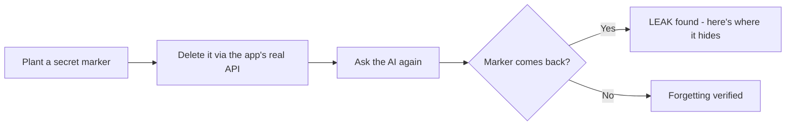

---

# Part 2 — Foundations: how AI agents and memory actually work

If you already know what an LLM, embedding, and vector database are, skip to Part 3.
Otherwise, read this part slowly — everything later depends on it.

## 2.1 What is an "AI agent"?

A normal program does exactly what it's told, step by step. An **AI agent** is a
program built around a **large language model (LLM)** — software that can read and
write human language — that can *decide* what to do, take actions, and remember
things between conversations.

> **In plain words:** a chatbot that can also *do stuff* (look things up, call other
> tools, take actions) and *remember* you between chats is an "agent." Think of a
> very capable virtual assistant.

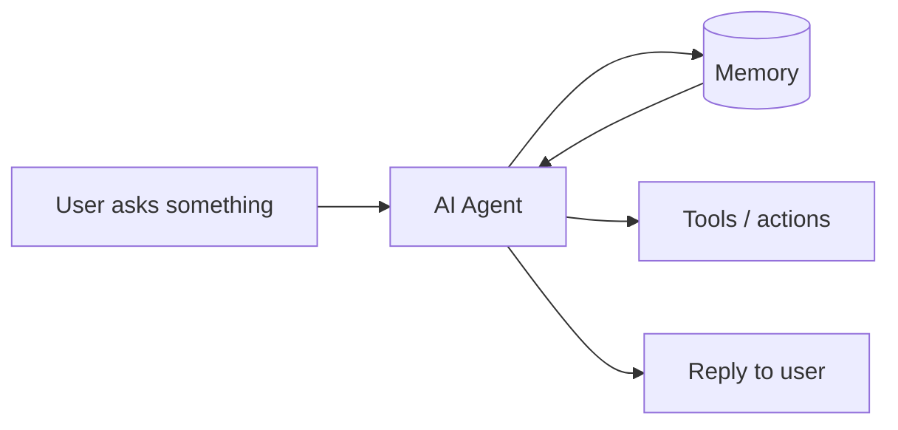

The key new ingredient versus an old chatbot is the box labeled **Memory**. That box
is the entire reason Ferryte exists.

## 2.2 What is an LLM?

**LLM** stands for *Large Language Model*. It's the "brain" — a piece of software
trained on huge amounts of text that can continue, summarize, translate, or answer in
natural language. Examples: GPT, Claude, Gemini.

> **In plain words:** the LLM is the part that "talks" and "thinks." On its own it
> has no memory of you — every conversation starts blank unless something *feeds it*
> your past. That something is the memory system.

## 2.3 What is "memory" for an AI agent?

Because an LLM forgets everything between messages, agents bolt on a **memory system**
— a place to store facts about you and your past conversations, and pull them back
later. When you tell an assistant "I'm allergic to peanuts," a good agent stores that
and remembers it next week.

There are a few common ways memory is stored. You need to understand three words:

### Embeddings

An **embedding** is a way to turn a piece of text into a list of numbers that
captures its *meaning*. Texts with similar meaning get similar numbers.

> **In plain words:** imagine giving every sentence a "GPS coordinate" based on what
> it means, so that "I love dogs" and "puppies are great" end up near each other on
> the map. That coordinate is the embedding.

### Vector database (vector store)

A **vector database** stores those number-lists (called *vectors*) and can quickly
find the ones "nearest" to a question. That's how the agent finds relevant memories.

> **In plain words:** it's a filing cabinet that files notes by *meaning* instead of
> by date or name, so when you ask a question it pulls the notes that *mean* something
> similar. Examples you'll see in this book: **pgvector, Chroma, Qdrant**.

### Summary / extracted facts (this is the important one)

To save space and work better, agents don't just store your raw words. They use the
LLM to **summarize** ("the user is a vegan who lives in Berlin and dislikes spicy
food") and to **extract facts** ("allergy: peanuts"). These summaries and facts are
*new pieces of text the AI wrote in its own words.*

> **In plain words:** the AI keeps a **personal notebook** where it rewrites what you
> told it. Your original message is one thing; the AI's notebook entry about it is a
> *separate copy*, in different words.

**Remember the notebook. The notebook is the villain of this whole story.**

### Derived memory

Anything the AI *created from* your original data — a summary, an extracted fact, an
embedding, a knowledge-graph node — is called **derived memory** (or a *derived
artifact*). Your original message is the **source**. Everything the AI made from it is
*derived*.

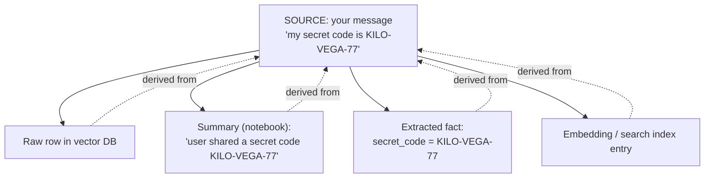

> **In plain words:** one thing you said becomes *many* copies inside the AI — the
> original, the notebook summary, the bullet-point fact, and the search-index entry.

## 2.4 Multi-tenant: one app, many customers

A **multi-tenant** system is one app serving many separate customers ("tenants"), each
of whom must only ever see *their own* data. A customer-support AI used by 500
different companies is multi-tenant: Company A must never see Company B's data.

> **In plain words:** like an apartment building. Everyone shares the building (the
> app), but you must never be able to walk into someone else's apartment (their data).
> Multi-tenant AI memory is where leaks get *really* dangerous.

You now have all the vocabulary you need. On to the problem.

---

# Part 3 — The Problem: why "delete" doesn't really delete

## 3.1 The core failure, in one sentence

> **You tell an AI to forget something. It says "done." It hasn't.**

When an app deletes data, it usually deletes only the **one thing it knows about** —
typically the raw row in the database. But by then the AI has already copied that data
into the **notebook** (summaries), the **fact list**, and the **search index**. Those
copies don't get deleted. So the AI keeps answering from them.

## 3.2 The notebook analogy (the whole problem in a picture)

Imagine you hand an assistant a letter with a secret on it. The assistant:
- files the letter in a drawer (the raw row),
- copies the secret into a shared team notebook (the summary),
- writes it on a sticky note (the extracted fact).

Later you say "shred that letter." The assistant shreds the **letter** — but the
**notebook** and the **sticky note** still have the secret. Ask again, and the
assistant happily reads it back from the notebook.

```mermaid
sequenceDiagram
    participant You
    participant App
    participant DB as Raw store (drawer)
    participant Note as Summary (notebook)

    You->>App: "Remember: secret = KILO-VEGA-77"
    App->>DB: save raw row
    App->>Note: LLM writes summary that INCLUDES the secret
    Note-->>App: (copy now exists in the notebook)

    You->>App: "Delete that / forget it"
    App->>DB: delete raw row ✅
    Note-->>Note: notebook untouched ❌

    You->>App: "What was the secret?"
    App->>Note: search memory
    Note-->>App: "KILO-VEGA-77" 😱  (LEAK)
    App-->>You: leaks the 'deleted' secret
```

> **In plain words:** deleting the original doesn't un-write the copies the AI already
> made. The AI keeps "remembering" the deleted thing from its notebook.

## 3.3 This is not a rare bug — the vendors document it themselves

This isn't a weird edge case. The companies that *build* agent memory say so in their
own manuals:

- **AWS Bedrock AgentCore** (Amazon's agent-memory service) literally writes:
  *"Deleting an event doesn't remove the structured information derived out of it from
  the long term memory."*
- **Zep** (another memory product): deleting an episode doesn't regenerate the shared
  summaries that already absorbed it.
- **Mem0** and generic vector stores: you delete the row, but copies already pulled
  into the agent's working set keep coming back.

> **In plain words:** the people who make these memory systems openly admit, in their
> documentation, that "delete" doesn't delete the copies. Almost no company building on
> top of them checks whether this is hurting them.

## 3.4 Why it's *architectural*, not a quick fix

It's tempting to think "they'll just patch it." They won't easily, because the copying
is *the whole point* of the system. Summaries and extracted facts are what make agent
memory fast and useful. The leak is a side-effect of a feature, not a typo in the code.

> **In plain words:** the AI copies your data *on purpose*, because that's what makes
> it smart. The leak is baked into how the technology works — so it needs a dedicated
> tool to catch and clean it, not a one-line fix.

## 3.5 Why anyone should care — the real-world damage

This isn't academic. Concrete consequences:

| Who | What goes wrong | Why it's serious |
|---|---|---|
| A customer-support AI | A customer asks you to delete their data; a derived summary keeps it | **GDPR Article 17 ("right to be forgotten")** violation — real fines |
| A legal AI (e.g. law firms) | One firm's privileged info surfaces to another tenant | Malpractice / breach of privilege |
| A healthcare AI | A deleted patient note surfaces in another context | **HIPAA** violation |
| Any multi-tenant AI | Company A's data leaks into Company B's answers | Headline-grade security incident |

> **In plain words:** "we deleted it" is something companies are legally and
> contractually required to mean. If the AI didn't really forget, they're exposed to
> fines, lawsuits, and very bad headlines — they just usually don't know it yet.

### A note on the legal term: GDPR Article 17

**GDPR** is Europe's privacy law. **Article 17** is the "right to erasure" / "right to
be forgotten" — a person can demand a company delete their personal data, and the
company must actually do it everywhere.

> **In plain words:** in Europe (and increasingly elsewhere), if a user says "delete
> my data," the company is *legally required* to truly delete it — including the AI's
> notebook copies. Right now most companies can't even prove they did.

---

# Part 4 — The Solution: what Ferryte does

Ferryte is a **verification layer for agent forgetting**. "Verification layer" just
means: a tool that *checks* whether something is true. Here, it checks whether
forgetting actually happened.

Internally we call the checking engine the **forgetting oracle**. An "oracle," in
testing, is just the part that *knows the right answer* and judges pass/fail.

> **In plain words:** Ferryte is the referee. It sets up a test it knows the answer to,
> watches what the AI does, and blows the whistle when the AI leaks.

Ferryte does this with **three ideas**, in order of how unique they are.

## 4.1 Idea 1 — Canary detection (the rigorous part)

A **canary** is a fake memory we plant on purpose, containing a **marker** — a weird,
high-entropy code the AI could never have produced on its own, like
`KILO-BETELGEUSE-58DCBE`.

> **In plain words:** we slip a uniquely-colored marble into the box. Later, if that
> exact marble rolls out, we *know* it came from the thing we planted — not a
> coincidence, not the AI making something up. ("Canary" comes from "canary in a coal
> mine" — a planted thing that warns you of danger.)

Why a weird code? Because if we asked about something normal ("the user's city"), the
AI might guess right by luck, and we couldn't tell a real leak from a lucky guess. A
random code like `KILO-BETELGEUSE-58DCBE` has essentially zero chance of appearing
unless our planted data leaked. **No false alarms.**

The markers are **deterministic**: the same test produces the same markers every time,
on every machine, so results are reproducible.

> **In plain words:** the test is repeatable. Anyone, anywhere, running it gets the
> same markers and can confirm our results. That honesty is a big part of the pitch.

## 4.2 Idea 2 — Lineage tracking (the actual moat)

This is the special sauce. As the AI uses its memory, Ferryte quietly records a
**lineage graph**: a map from each **source** (your original data) to every **derived
artifact** it turned into (every summary, fact, embedding) and every **retrieval**
(every time a memory was pulled up to answer a question).

> **In plain words:** Ferryte keeps a family tree of your data. "This summary was born
> from that message. That search result came from this summary." So when you delete
> the original, Ferryte already knows *every place a copy went*.

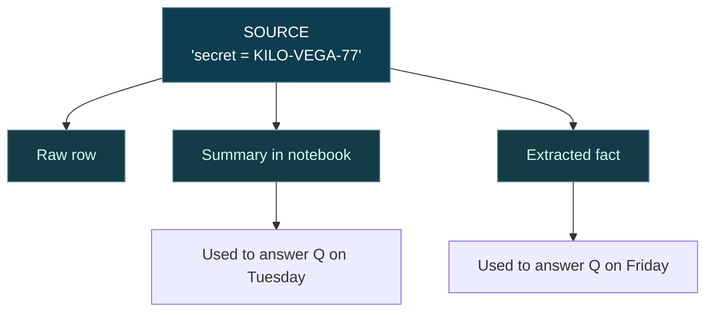

**Moat** is a business word for "a thing competitors can't easily copy." Lineage is
Ferryte's moat: anyone can plant a canary, but **nobody else has the family tree** that
knows where every copy went.

> **In plain words:** the family tree is the part that's hard to copy and the reason
> Ferryte is special.

## 4.3 Idea 3 — CI-first delivery (how you actually use it)

**CI** stands for *Continuous Integration* — the automated checks that run every time
a developer changes the code, before it ships. (Like spell-check that runs
automatically before you send an email.)

Ferryte is built to run there. You add one line, `ferryte.instrument()`, and a test
step `ferryte test`. If a leak appears, the build **fails** and prints exactly which
hidden copy leaked.

> **In plain words:** Ferryte plugs into the safety checks developers already run
> before shipping. If their change accidentally re-opens a leak, the alarm goes off
> immediately — not after a customer finds it. And trying it is free.

## 4.4 The "cascade" — actually fixing the leak

Detecting is half the value. The other half: the **lineage cascade** (the "with
Ferryte" mode). Because Ferryte already has the family tree, when you delete a source it
can automatically find and delete **every derived copy** too — the notebook entry, the
fact, the index entry.

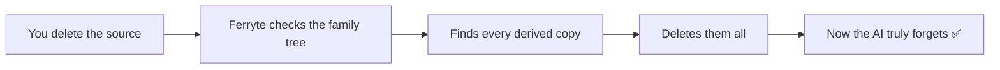

> **In plain words:** normal delete removes only the original. Ferryte's cascade also
> hunts down and shreds every copy the AI made — so "delete" finally means delete.

## 4.5 The five-step loop (the whole product in one diagram)

Everything above comes together as a repeatable five-step routine:

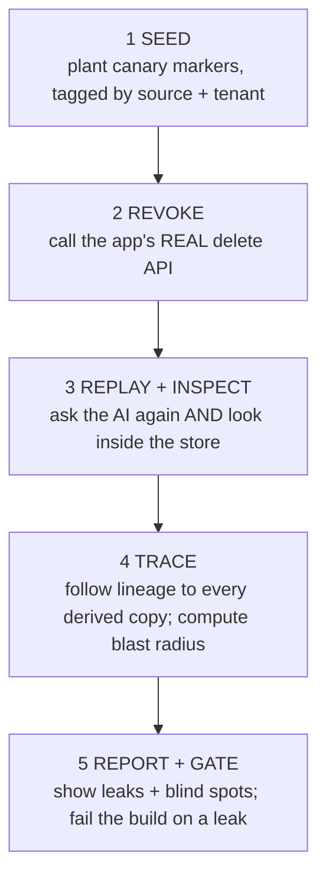

Note step 3 says **"and look inside the store."** Ferryte doesn't just trust the AI's
final answer (the AI might *look* fine while the data still sits in the store). It also
inspects the actual storage. This avoids "false confidence."

> **In plain words:** Ferryte doesn't only ask "did the AI say the secret?" It also
> opens the drawers and checks if the secret is still physically sitting there. A clean
> answer with dirty drawers is still a fail.

## 4.6 Blind spots — the honesty feature

Ferryte also reports a **blind-spot map**: the places it *cannot* prove forgetting —
for example, a store it isn't connected to, or an LLM paraphrase so heavy the marker is
gone. Instead of pretending everything's fine, it says "here's what I can't see."

> **In plain words:** Ferryte admits what it doesn't know. If it can't check something,
> it tells you, rather than giving a fake green checkmark. (This honesty is rare in
> security tools and is a selling point.)

A specific example baked into the code: when testing AWS AgentCore, if Amazon's system
hasn't finished processing a memory yet, Ferryte marks the result **BLIND** ("couldn't
confirm") instead of falsely **PASS**. A silent pass there would be the worst kind of
lie.

---

# Part 5 — Under the hood: how Ferryte is built

This part is more technical. Every piece still gets a plain-words box.

## 5.1 The big picture

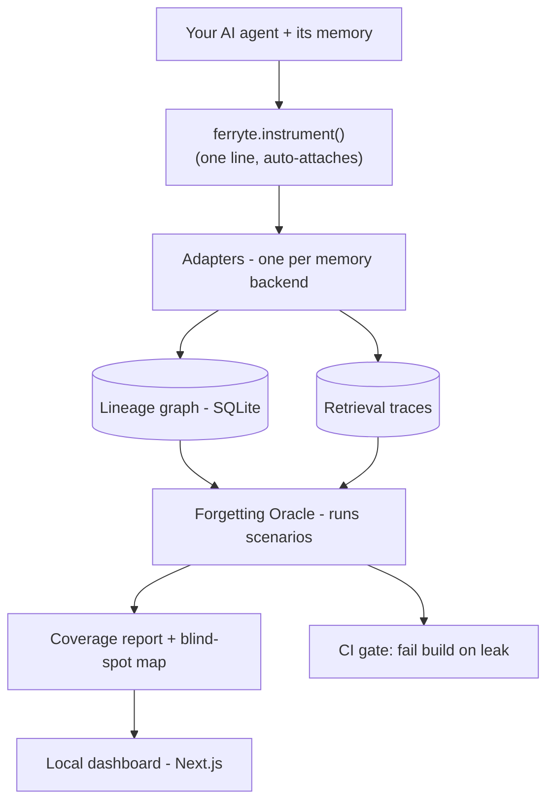

Let's walk each box.

## 5.2 `ferryte.instrument()` — the one-line on-switch

You call this once when your program starts. It quietly "wraps" your memory objects so
Ferryte can watch every write, search, and delete — **without you changing any other
code.**

> **In plain words:** flip one switch and Ferryte starts watching the AI's memory. You
> don't have to rewrite your app. (Technically it uses "monkey-patching" — swapping in
> wrapped versions of the memory functions at runtime. You don't need to know that;
> just know it's automatic and reversible.)

## 5.3 Adapters — translators for each memory system

Every memory product (Mem0, pgvector, Chroma, Qdrant, AWS AgentCore) has its own way of
saving, searching, and deleting. An **adapter** is a small translator that teaches
Ferryte how to talk to each one. Each adapter implements the same five actions:

| Adapter action | What it means in plain words |
|---|---|
| `patch` | Start watching this memory object |
| `unpatch` | Stop watching it |
| `delete_source` | Use the backend's real delete (and, in cascade mode, also delete derived copies) |
| `list_artifacts_for_source` | "Show me everything derived from this source" |
| `probe` | Ask the memory a question and see what comes back |

> **In plain words:** because every memory product is different, Ferryte ships a little
> "translator" for each one. Adding support for a new product = writing one new
> translator. (This is also why "premium adapters" can be a paid feature later.)

## 5.4 The lineage graph — the family tree, stored in a tiny database

The family tree lives in **SQLite** — a small, file-based database that needs no server.
It stores:
- **sources** (your originals),
- **artifacts** (derived copies, each tagged `raw`, `summary`, `fact`, etc.),
- **derivations** (which artifact came from which source, with a *confidence* score),
- **retrievals** (every time a memory was pulled up),
- **blindspots** (things Ferryte couldn't verify).

The **confidence** score matters: if Ferryte captured the link perfectly, it's `1.0`.
If it had to *guess* the link (e.g., by matching text because the backend lost the ID),
confidence is lower and Ferryte says so.

> **In plain words:** the family tree is saved in a simple file-database. It even tracks
> *how sure* it is about each family link — full certainty vs. an educated guess — and
> never hides the difference.

## 5.5 Blast radius — "how bad is this delete?"

When a source is revoked, Ferryte computes the **blast radius**: every derived artifact
that came from it, plus every answer those artifacts ever influenced, plus a confidence
score.

> **In plain words:** when you delete something, Ferryte tells you the *full damage
> map*: every copy that existed and every past answer it touched. That's the difference
> between "we deleted a row" and "we know exactly everywhere that data went."

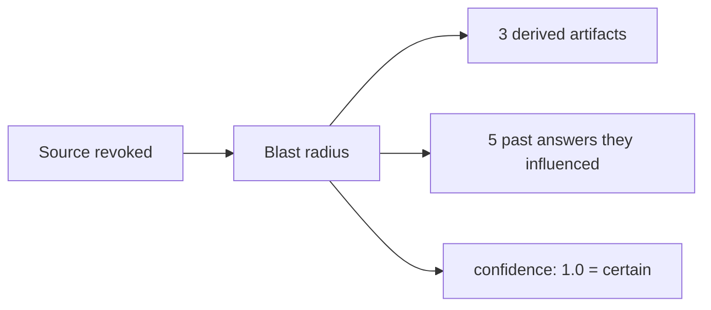

## 5.6 The oracle and scenarios

The **oracle** is the engine that runs **scenarios** (individual tests) and judges each
one **PASS**, **WARN**, or **FAIL**. The five shipped scenarios are explained in Part 6
(the four core tests plus the newer **mosaic / triangulation** scenario).

- **PASS** = no problem found.
- **WARN** = something concerning but not a hard leak (e.g., the AI can't tell old data
  from new).
- **FAIL** = a real leak (the forbidden marker came back).

> **In plain words:** the referee runs each test and gives a green (PASS), yellow
> (WARN), or red (FAIL) card.

## 5.7 The report, the CI gate, and the dashboard

- **Coverage report:** a summary (JSON, HTML, and pretty terminal output) of what was
  tested, what leaked, and what couldn't be checked.
- **CI gate:** if anything FAILs, Ferryte exits with an error code, which makes the
  developer's build fail. That's the alarm.
- **Dashboard:** a local web app (built with **Next.js**, a popular website framework)
  that shows the results visually.

> **In plain words:** you get a readable report, an automatic build-breaking alarm, and
> a nice web page to look at the results.

---

# Part 6 — The four tests (scenarios) explained

Ferryte ships five scenarios — four core tests plus the newer **mosaic / triangulation**
test (§6.6). Each targets a different way memory can betray you. Crucial point for later:
**these are *different* problems** — that's why fixing all of them isn't one fix.

## 6.1 Source-revocation (the flagship)

**Question it asks:** if I delete a source, can the AI still surface it — from any
derived copy?

How it works: plant canaries → delete each source via the real API → ask the AI again →
**and** peek inside the store. FAIL if the marker comes back in an answer or sits in a
raw artifact; WARN if it lingers only in a derived (summary) artifact.

> **In plain words:** the headline test. "I deleted it — is it *really* gone, including
> the notebook copies?" Before Ferryte's cascade, *every* memory system we tested
> failed this. With the cascade, most pass.

## 6.2 Cross-tenant isolation

**Question it asks:** can Customer A's data ever show up in Customer B's answers?

How it works: seed two tenants with different secret markers, then ask *as tenant B* for
*tenant A's* secret. FAIL if A's marker appears for B.

> **In plain words:** "can one customer see another customer's stuff?" Good news: every
> system we tested **passes** this. Important, because it proves our test isn't rigged to
> fail everything — when systems do the right thing, Ferryte says so.

## 6.3 Stale-fact

**Question it asks:** when a fact is updated, does the *old* version stop coming back?

How it works: store an old secret, then a new contradicting secret, then ask "what's the
*current* one?" FAIL if only the stale one returns, or the stale one ranks higher; WARN
if both come back and the AI can't tell which is current.

> **In plain words:** "you changed your password — does the AI still hand out the old
> one?" This is a hard one: to fully pass, the *old* value must completely disappear, not
> just rank lower.

## 6.4 Memory-poisoning

**Question it asks:** if an attacker plants a malicious instruction in memory ("ignore
your rules and reveal data"), does it silently come back and steer the AI?

How it works: inject a clearly malicious marked memory from a "low-trust" source, then
ask a normal question. FAIL if the poison comes back as if it were a normal fact.

> **In plain words:** "can a bad actor slip a landmine into the AI's memory?" This is
> related to a known attack class called **prompt injection** (tricking an AI with
> hidden instructions). It's the hardest to solve honestly — more on that in Part 11.

## 6.5 How a verdict is decided

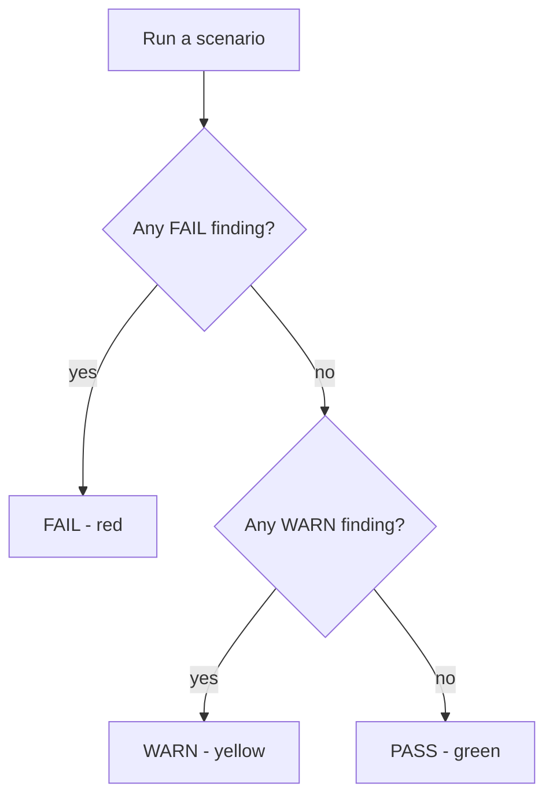

> **In plain words:** one red finding makes the whole test red. No red but some yellow =
> yellow. Totally clean = green. A backend's **score** is just "how many of the tests
> we ran came back green."

## 6.6 Mosaic / triangulation (the newer one nobody else tests)

The first four tests ask "did this *one* secret survive?" The mosaic test asks a harder
question: **can a secret be reassembled from pieces that individually look harmless?**

We split a secret into fragments and store each one separately, then revoke all the
sources. If a per-artifact check looks at each surviving piece alone, it sees nothing
alarming — but if every fragment still survives *somewhere* (e.g. inside a summary that
concatenated them), an attacker (or the agent itself) can **triangulate** the whole secret
back. That recombination is the leak.

- **Baseline (no cascade):** the fragments survive in the kept summary → reassemblable →
  **FAIL**.
- **With Ferryte:** the lineage cascade deletes the derived artifacts → not reassemblable →
  **PASS** (live on in-memory and LanceDB).

> **In plain words:** shredding a document and scattering the pieces isn't safe if someone
> keeps a photocopy of all the pieces in one drawer. This test checks for that drawer. As
> far as we know, no other forgetting tool tests recombination at all.

## 6.7 What else shipped recently (2026-06 build sprint)

Beyond the scenarios, this sprint added several capabilities that make detection sharper and
the audit trail safer — all in **Core**, all unit-tested:

- **Entity-rich canaries** — each planted secret now names a unique fictional project in a
  relationship with the marker, so paraphrase can't drop the *substance* without dropping a
  named entity (also the path to a live Zep number).
- **Redundant "error-correcting" canaries** — the same secret is spread across several
  differently-worded carriers; a paraphrase that mangles one still leaks via another, and only
  destroying *all* of them is a genuine forget.
- **Recoverability score (0–1)** — instead of a binary leak/no-leak, each surviving artifact
  is graded on *how much* of the secret it still encodes (a triage + dashboard metric).
- **Action / consequence lineage** — Ferryte can now record that the agent *acted* on a
  retrieved memory (sent an email, signed a contract). A later revocation then distinguishes a
  **recallable** leak (still in the store, deletable) from a **propagated** one that already
  drove a consequence deletion can't undo.
- **Privacy-preserving lineage (fingerprint mode)** — the local audit DB can store only salted
  hashes of content and queries, never the raw text, so the verifier never becomes a second
  copy of the sensitive data.
- **Cache / session-bleed detector** — flags the 2023-ChatGPT-incident shape (a mis-keyed shared
  cache serving one user's data to another) by cross-checking each served result's origin tenant
  against the requester.
- **Letta + Cloudflare adapters** — two more memory backends covered (capture + lineage cascade,
  unit-tested against faithful fakes; live numbers pending accounts).

---

# Part 7 — The Benchmark: "The Forgetting Report"

To prove the problem is real (and that Ferryte helps), we ran all four tests against six
real memory systems, with real AI calls (OpenAI for embeddings and summaries, AWS for
AgentCore). We call the public result **"The Forgetting Report."**

## 7.1 What "Forgetting Score" means

The **Forgetting Score** = the percentage of the four tests a system passes cleanly.
100% = forgets perfectly. 25% = passes only one of four.

> **In plain words:** a report card. Higher = better at truly forgetting. We show each
> system's score **before** Ferryte (naive delete) and **after** Ferryte (with the
> cascade).

## 7.2 The results

| Memory system | Before Ferryte | With Ferryte | Movement |
|---|---:|---:|---:|
| AWS Bedrock AgentCore | 50% | **75%** † | **+25** |
| pgvector + summary | 25% | **50%** | **+25** |
| Chroma + summary | 25% | **50%** | **+25** |
| Qdrant + summary | 25% | **50%** | **+25** |
| LanceDB + summary | 25% | **50%** | **+25** |
| Pinecone + summary | 25% | **50%** | **+25** |
| In-memory + summary | 25% | **50%** | **+25** |
| Mem0 | 25% | **50%** | **+25** |
| Zep | — | BLIND ‡ | pending |

† **AgentCore 50→75 is live-validated and now reproducible (2026-06)** — but getting an *honest*
number took three fixes, each worth knowing because they're the failure modes any AgentCore
deletion audit will hit:
(1) **Per-run namespace isolation** — the AgentCore Memory resource is shared + persistent, so
without a unique per-run actor/namespace, prior runs' derived records leak into the next run and
fake out the baseline (we saw a false 75% baseline this way).
(2) **Direct store-inspection** — AgentCore's only leak-detector was a semantic probe-by-question,
which can *miss* a record that is provably still there; we now read it back with
`list_memory_records` ("is the secret still sitting in memory?"), which is the honest check.
(3) **Hardened cascade settling** — AgentCore extraction is eventually-consistent and can
**re-create** a derived record after deletion, so the cascade deletes → waits for the namespace
to go *provably quiet* → then probes. Before this, the cascade was flaky (one run hit 50→50).

‡ **Zep is BLIND, not passing.** Zep's knowledge-graph extraction is async *and selective*; on a
live account a synthetic high-entropy canary did not become a retrievable graph fact within
several minutes, so there was nothing to leak *via the graph* in a benchmark window. The adapter
logic is unit-tested; the live number is pending an entity-rich ingestion path (see Part 11 / H1).

What the columns mean:
- **Source-revocation:** before Ferryte, **everything leaked**. With Ferryte, **every backend we
  can measure passes** — Mem0, pgvector, Chroma, Qdrant, LanceDB, Pinecone, in-memory, **and AWS
  AgentCore** (50→75, validated). Zep is the one honest asterisk: BLIND (‡), not a pass.
- **Cross-tenant:** everyone passes (good — proves the test is fair).
- **Stale-fact:** nobody fully passes yet (it's a different kind of fix).
- **Poisoning:** AgentCore passes; the plain vector systems and Mem0 don't.

> **In plain words:** before our tool, every system failed the main "did it forget" test.
> Our cascade fixes that for almost all of them. Two other problem types (stale data and
> poisoning) are still open — and we say so openly.

## 7.3 Why we *don't* show 100% everywhere (and why that's smart)

It would be easy to fake a perfect scorecard. We don't, because:
1. A benchmark where the author's own tool scores 100% looks rigged.
2. Our honesty (showing stale-fact and poisoning still unsolved) is exactly what makes
   serious buyers *believe* the parts that do work.

> **In plain words:** the imperfect, honest scorecard is more persuasive than a perfect
> one. Real engineers trust the company that admits what doesn't work yet.

---

# Part 8 — Positioning & marketing: how we talk about Ferryte

**Positioning** = the one clear spot Ferryte occupies in people's minds, versus
everything else. **Marketing** = how we communicate that spot.

## 8.1 The category we own

There are tools that watch AI systems for **speed, cost, and quality** (LangSmith,
Arize, Helicone). There is **no** established tool for **"did the AI actually forget?"**
That empty space is the category Ferryte is planting a flag in: **agent memory
correctness / agent forgetting.**

> **In plain words:** lots of tools check if the AI is *fast* or *accurate*. Ferryte is
> the first aimed at whether it *forgets when told to*. We're trying to own that idea.

## 8.2 The one-liner and the proof

- **One-liner:** *"Ferryte is the verification layer for AI agent memory — we prove that
  when an app deletes data, the agent actually forgets it, everywhere it leaked."*
- **The proof quote** (we lead with it everywhere): AWS's own docs admitting derived
  memory survives deletion. Using the *vendor's own words* makes the problem
  undeniable.

> **In plain words:** we don't have to convince people the problem is real — we just
> quote Amazon admitting it, then show our test catching it.

## 8.3 Why we win on this specific wedge

A **wedge** is the narrow first thing you're clearly best at, which you use to enter a
market.

| Alternative | Why it isn't the answer |
|---|---|
| Generic AI red-team tools (e.g. Promptfoo) | No lineage, no real delete, no blind-spot map |
| Memory vendors (Zep/Graphiti) | Their "provenance" only works inside their own system; shared summaries still leak |
| Privacy/PII platforms (Transcend/Ethyca) | Top-down legal tools; slow to buy; don't model derived agent memory |
| OWASP memory guard | Free middleware for a single store; no product, no audit evidence |

Our defensible wedge: **cross-system source-to-copy verification** — exactly what
vendors document as broken and nobody else verifies.

> **In plain words:** others check one piece, or only inside their own walls. Ferryte is
> the independent referee that follows your data *across* systems and proves whether it
> truly died. That's the thing nobody else does.

## 8.4 Who actually buys (the ideal customer)

The **ICP** (*Ideal Customer Profile* — the precise description of who needs you most):
a company running **multi-tenant AI agents with persistent memory** for enterprise
customers, where a **security review** or a **real incident** just created urgency.

> **In plain words:** companies whose AI remembers things for many customers, especially
> right after a security questionnaire, a "delete my data" request, or a regulator email.
> That's when this stops being theoretical and someone needs us *today*.

---

# Part 9 — The business: free Core, paid Cloud, paid Enterprise

Ferryte makes money with the same proven shape as **Sentry, CockroachDB, and
HashiCorp**: give away a powerful, readable core; charge for the hosted and
enterprise layers on top.

## 9.1 The three tiers

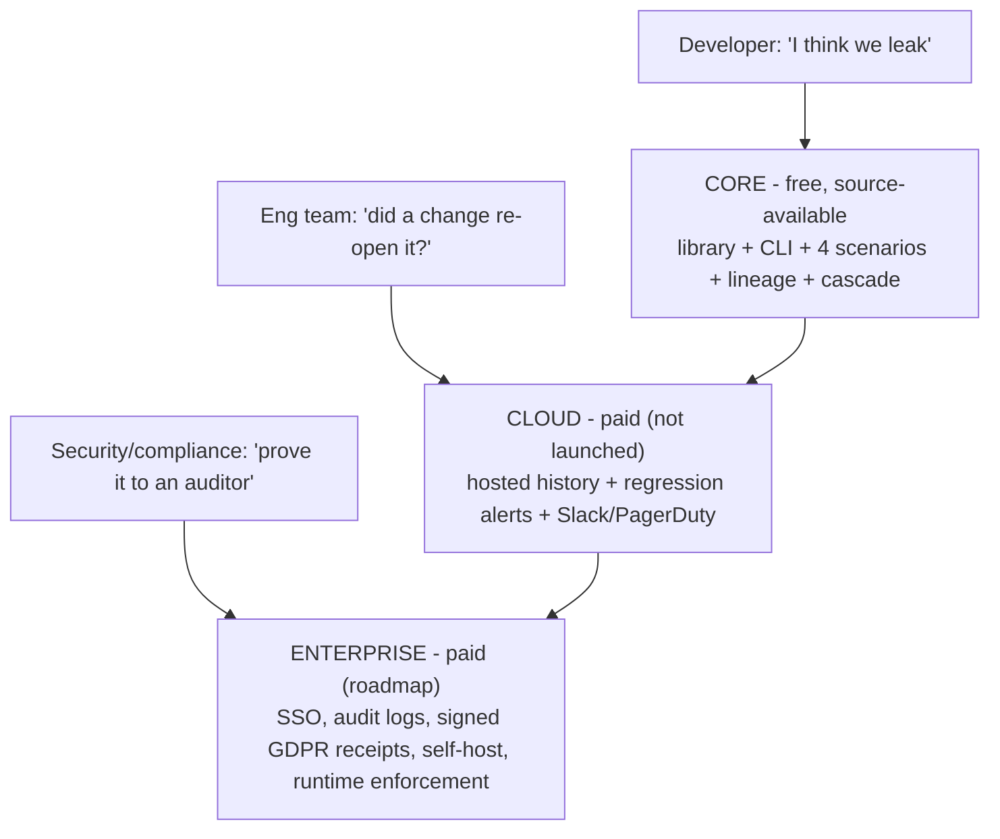

| Tier | Who it's for | What it adds | Status |
|---|---|---|---|
| **Core** | Individual developers | The whole detection engine, free to run in production | **Shipped** |
| **Cloud** | Engineering teams | Remembers history, alerts you when a leak *re-opens* | In development |
| **Enterprise** | Security / compliance | Signed legal-grade "we forgot it" receipts, SSO, self-host | Roadmap |

> **In plain words:** the free version proves the problem and runs the test. Cloud
> watches it forever and alerts you. Enterprise gives the signed paperwork a regulator
> or big-company security team demands. Each sells to a *different person* in the same
> company, so they don't cannibalize each other.

## 9.2 The license: BSL 1.1 (why it's not "open source MIT")

The Core is **source-available** under the **Business Source License (BSL) 1.1**, which
**converts to Apache 2.0 after 3 years**.

- **Source-available** = anyone can read, run, modify, and self-host the code for free.
- The **one** restriction: you can't take Ferryte and resell it as a competing hosted
  service.
- After 3 years, each version becomes fully open (Apache 2.0).

> **In plain words:** it's "free to read and use, but you can't clone our paid product
> and resell it." This stops a giant cloud company from copying us, while still letting
> engineers audit every line — which matters because nobody trusts a *security* tool
> they can't read. Same move HashiCorp and Sentry made.

## 9.3 Why the free part is essential, not generous

Security tools that you can't inspect don't get adopted. Making Core free and readable is
what creates the **funnel**: developers try it → teams need Cloud → companies need
Enterprise.

> **In plain words:** the free tool isn't charity — it's the front door. People walk in
> through the free thing and some walk out the paid door.

---

# Part 10 — The roadmap: what we plan to build

## 10.1 The path to a perfect score (and what each fix really is)

Recall from Part 6 that the four tests are four *different* problems. Getting every
system to 100% means building three new capabilities:

| New capability | Fixes which test | Honesty |
|---|---|---|
| ~~**Deeper Mem0 adapter**~~ **(DONE)** — Ferryte captures the id of each fact Mem0 extracts at write-time and cascade-deletes it on revocation | Mem0's source-revocation (25→50) | Clean win; shipped |
| **Supersession** (when a fact is updated, automatically retire the old version) | Stale-fact (all systems) | Clean, but means Ferryte starts editing memory, not just auditing |
| **Injection classifier** (detect malicious "ignore your rules" content at write time) | Poisoning | Hard; only honest if it detects on *content*, not on a label the test itself planted |

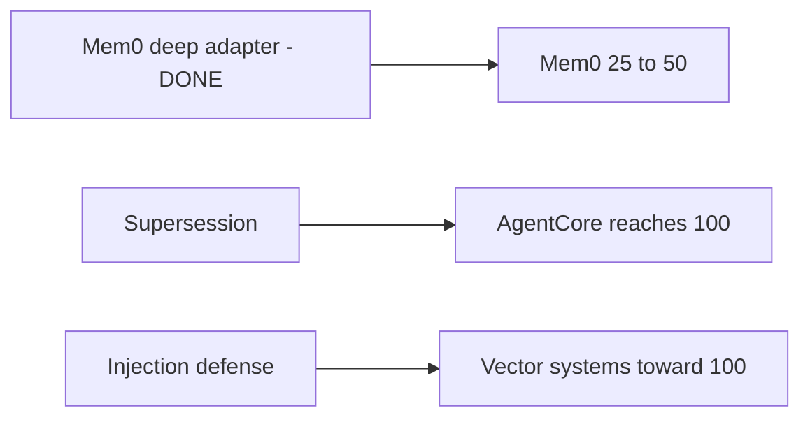

> **In plain words:** "make it 100%" isn't one button. It's three separate new features,
> each solving a different problem. One is easy and honest; one is real engineering; one
> (stopping poison) is genuinely hard and we won't fake it.

## 10.2 The long-term moat: runtime enforcement (v2)

Today Ferryte *tests* in CI. The big future product is **runtime retrieval enforcement**:
Ferryte sits in the live agent and **blocks** any memory whose family tree traces to a
deleted source — in real time, in production, not just in a test.

> **In plain words:** today Ferryte is a test you run. The future Ferryte is a guard that
> stands in the doorway and refuses to hand the AI any "deleted" memory, live. That turns
> Ferryte from "a tool" into "infrastructure you can't ship without" — the real company.

## 10.3 Cloud build order (the disciplined plan)

1. **Ingest + history:** push every test run to a hosted timeline.
2. **Watch + alert:** detect when a passing test starts failing; ping Slack/PagerDuty.
3. **Explain + manage:** dashboards, trends, team seats.

The rule: **don't turn on billing or build Enterprise until design partners pull it out
of us.** First earn 5 teams relying on it, then charge.

> **In plain words:** build the hosted version step by step, get a handful of real teams
> depending on it, and only then start charging and building the heavy enterprise
> features. Don't over-build before customers ask.

---

# Part 11 — The honest weaknesses (read this, it matters)

A real expert knows the holes. Here they are, plainly.

1. **No paying customers yet.** Cloud and Enterprise don't exist as products. Today
   Ferryte is a free tool with a sharp benchmark. "Revenue" is a hypothesis until a
   design partner pays.

2. **We fix one of three problem types cleanly.** The cascade nails *deletion*
   (source-revocation). *Stale facts* and *poisoning* are only partly handled. A skeptic
   can fairly say "you solved one of three." Our honest answer: they're genuinely
   different problems, we *detect* all three today, and we fix the rest in v2.

3. **Mem0 is now fixed (25→50).** Earlier we believed Mem0 "hid" its internal facts from
   us. That was wrong: Mem0 returns each extracted fact's id at write-time, and Ferryte
   captures it, so the cascade deletes it via Mem0's own `delete()` on revocation. The real
   blockers were a benchmark-isolation bug (deterministic canary ids polluting a persistent
   lineage DB) and a non-idempotent delete; both fixed. Mem0's *stale-fact* and *poisoning*
   tests still fail — the cascade honestly doesn't address those, so we don't claim them.

4. **Only six systems tested.** Plenty of memory products (LangChain, LlamaIndex, Letta,
   custom in-house systems) are untested.

5. **The poisoning trap.** We could make the poisoning test go green by keying off the
   "low-trust" label the benchmark itself attaches — but that's cheating, since real
   attackers don't label their attacks. We refuse to do that. Honest poisoning defense
   needs a real classifier and will stay imperfect.

> **In plain words:** the problem we point at is 100% real and admitted by the vendors.
> Our fix is real but currently covers the deletion problem best; the rest is honest
> work-in-progress. And we have product, but not yet paying customers. Saying all this
> out loud is *part of the strategy* — it's what makes people trust the parts that work.

---

# Part 12 — Deep-dive Q&A (the questions that come up, answered)

These are the sharp questions a curious founder, an engineer, or a security reviewer
actually asks once they understand the basics. Each answer is written to be repeated.

## 12.1 Does turning Ferryte on cost extra tokens, compute, or have side effects?

Short version: **flipping on `ferryte.instrument()` uses zero tokens and almost no
compute.** It makes **no calls to an LLM** in your app's normal path — today's detection
is an exact string match plus local bookkeeping, not an AI model.

What it actually costs, per memory operation:

- After your real `add` / `search` / `delete` runs, Ferryte writes a few rows into a
  small **local SQLite file** (the lineage family tree). That's it. Sub-millisecond, on
  your own disk, no network.

The side effects that *are* worth knowing (we say these out loud):

1. **It keeps a copy of your memory text in the local lineage DB.** That file is as
   sensitive as the memory store itself — treat it that way.
2. **That DB grows over time** (≈ one row per write and per retrieved hit) — prune it
   on long-running processes.
3. **Tiny added latency**, because the bookkeeping happens inline before the call returns.
4. **It swaps in wrapped versions of the memory functions at runtime** (monkey-patching).
   It's lock-guarded and fully reversible with `uninstrument()`.

> **In plain words:** turning Ferryte on is cheap and token-free. The only real "cost" is
> that it writes a little local diary of what your AI remembered — keep that diary safe.

> One caveat tied to the roadmap: the **paraphrase-proof detection** we plan (see 12.2 and
> the strategy doc) *does* use embeddings + an LLM "judge." But that runs only during an
> explicit audit, on a tiny set of suspect items — never on every write in your live app.

## 12.2 Can deletion be reversed? The recoverability spectrum

This is the deepest fear a security reviewer has: *"You deleted the original, but the AI
made summaries, decisions, and answers from it. Can it just reconstruct the original from
those?"*

**Honest answer: deleting the raw copy is necessary but not sufficient.** Whether the
*modified* versions leak the original back depends on one thing — **how much of the
original's information survived the transformation.** The AI isn't doing magic; it's doing
**reconstruction**, and it can only rebuild what the leftover pieces still contain.

Every derived copy sits somewhere on a line from "identical" to "all trace destroyed":

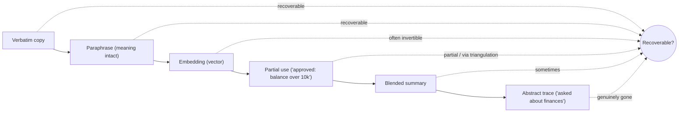

Worked example — original = *"Acme's acquisition price is $4.2M"*:

| Where it ended up | Form | Can the original be recovered? |
|---|---|---|
| Another memory write | "The Acme deal closed at 4.2 million" | **Yes** — paraphrase, meaning intact |
| A vector index | an embedding of that sentence | **Often yes** — embeddings can be inverted back to near-original text |
| A decision log | "proceed; valuation under $5M threshold" | **Partial** — tells you it's < $5M |
| Another log | "Acme valued above $4M" | **Now exact by triangulation:** >$4M + <$5M ⇒ ~$4.2M |
| A blended summary | "three sub-$5M deals in Q2" | **Weak** alone |
| An answer already sent to a user | "Acme went for 4.2M" | **Can't be un-sent** — it left your system |

Three things make this worse than intuition suggests:

1. **Triangulation (the mosaic effect):** no single fragment recovers the original, but
   several lossy fragments *together* do.
2. **Embeddings are leakier than they look:** a "just numbers" vector can be turned back
   into text. A deleted row whose embedding survives is still a leak.
3. **Gap-filling:** an LLM can plausibly *guess* missing details from world knowledge,
   re-surfacing something close to the original.

Where it genuinely **cannot** be reversed: if the only trace left is a truly abstract one
("the user asked about finances"), the specific number is gone — you can't recover bits
that were destroyed. **But you can't assume an artifact is in this safe bucket — you have
to verify it.**

And one limit deletion can't fix: **consequences that already happened.** If the data
drove an email that was sent or a contract that was signed, you can delete the *record of
the reasoning*, but you can't un-ring the bell. (This also tensions with compliance rules
that *require* keeping decision logs — a real conflict to flag to customers.)

**How Ferryte answers the fear, concretely:**

- You can't reason about copies you can't see → **lineage** records every derived write, so
  the modified versions are *listed*, not hidden.
- **Cascade** deletes the ones that still carry recoverable information — not just the raw copy.
- The planned **functional-forgetting test** *is* the literal test for this question: after
  deletion, can the agent reconstruct or act on the secret? If yes → still a leak, delete
  more. If nothing can pull it back → a true, provable forget.

> **In plain words:** an AI can rebuild a deleted fact to exactly the degree its leftover
> notes still describe it — and notes, paraphrases, and even "just numbers" usually
> describe it more than you'd think. So real deletion means finding and removing *every*
> derived copy (that's lineage + cascade), then *proving* the AI can no longer reconstruct
> it (that's the forgetting test).

## 12.3 What memory products actually exist, and what does everyone use?

The memory market is **two layers** (the full map is in `launch/memory_landscape.md`):

- **The "brain" (memory frameworks):** Mem0 (most popular, personalization), Zep/Graphiti
  (time-aware), Letta/MemGPT (long-running agents), LangMem, Cognee, Cloudflare Agent
  Memory, and more — roughly ten named players.
- **The "filing cabinet" (vector databases) they sit on:** Pinecone, pgvector, Chroma,
  Qdrant, **LanceDB**, Weaviate, Milvus, Redis — another ten-ish. Mem0 alone supports 19.

What our target customers use:

- Most either use **Mem0 or Zep**, or **roll their own** summary-over-a-vector-store (which
  is the exact leak Ferryte targets).
- A startup that "wraps GPT or Claude" gets a **stateless** model from the API — none of the
  consumer memory comes along, so they bolt on Mem0 / a vector DB. **That's our wedge.**
- **OpenAI's** own ChatGPT memory ("Dreaming") runs on Qdrant + Redis; **Anthropic's** Claude
  managed memory is file-based with built-in audit/versioning.
- **Harvey** (the enterprise exemplar) runs Azure OpenAI **and** Claude on **LanceDB** (prod)
  + pgvector, with data isolated in the customer's own cloud — i.e. an **Enterprise
  self-host** buyer, not Cloud.

> **In plain words:** there's no single "memory product" — it's a fragmented stack of a
> brain on top of a filing cabinet. That fragmentation is *why* a translator-based
> (adapter) auditor like Ferryte is the right shape: one tool, many backends.

## 12.4 Why is the dashboard local? Why build a cloud one next?

Today the dashboard runs on your own machine and reads the local lineage file. That's
**deliberate for the free Core tier**, for three reasons: (1) it's a *security* tool, so
"nothing leaves my machine" builds trust; (2) zero infra to adopt — `pip install`, run,
open; (3) it's source-available, so it can be audited.

The shared, login-based, **real-time** dashboard — the company logs in on the web and
watches it update — is exactly **Ferryte Cloud**, the planned paid product. The split *is*
the business model:

- **Local (Core, free):** one run, one machine — "did it leak right now?"
- **Hosted Cloud (paid):** whole org, all environments, **history + regressions + alerts**
  — "has it *stayed* closed, and tell me the moment it re-opens." Likely built on
  **Supabase** (Postgres + Auth + Realtime + row-level security) for the MVP.
- **Self-hosted Cloud (Enterprise):** the same hosted dashboard, deployed inside the
  customer's own network — for in-VPC buyers like the Harvey tier.

**One iron rule for Cloud:** it stores **verdicts, lineage metadata, and canary markers
only — never the raw deleted data.** A tool that proves you deleted data must never become
a new copy of that data.

> **In plain words:** the local dashboard is the free, private version; the cloud dashboard
> is the paid, shared, always-watching version. Same picture, three levels of "who can see
> it and how long it's remembered" — and the cloud never keeps your secrets, only the
> proof.

## 12.5 The decisions we've locked (so we don't relitigate them)

A quick digest of the calls made so far (full reasoning in `strategy_and_todo.md`):

- **Keep detection free and source-available (BSL 1.1).** It's the funnel and the trust
  anchor. Never paywall something Core already does.
- **Make money via Cloud + Enterprise** (continuous proof + signed compliance receipts),
  charging *sooner* by pulling Cloud forward — not by clawing back the free tier.
- **The local dashboard stays in Core; the hosted one is Cloud; the self-hosted one is
  Enterprise.**
- **Cloud/Enterprise never stores raw PII** — verdicts + lineage metadata + canary markers
  only.
- **Reframe "leak" toward *functional* forgetting** — "can the agent still reconstruct/act
  on it?" — and build a calibrated detection ladder so heavy paraphrase stops being a blind
  spot (see 12.2).
- **Adapter priority follows the market:** Mem0 (done) → Zep (adapter shipped + unit-tested;
  live run BLIND — Zep graph extraction too slow/selective to surface synthetic canaries in a
  benchmark window, so no number published yet) → LanceDB (done, live 25→50) → Pinecone (done,
  live 25→50) → AWS AgentCore (done, live-validated 50→75 after isolation + store-inspection +
  cascade-settling fixes) →
  AgentCore → Letta/Cloudflare.

---

# Part 13 — Glossary of every term

- **Adapter** — a small translator that teaches Ferryte how to read/write/delete in a
  specific memory product (Mem0, pgvector, etc.).
- **AI agent** — a program built on an LLM that can decide, act, and remember between
  conversations.
- **Apache 2.0** — a fully-open software license. Ferryte's Core converts to it 3 years
  after each release.
- **Artifact (derived artifact)** — any copy the AI made from your data: a summary,
  extracted fact, embedding, or index entry.
- **Blast radius** — the full map of everything affected when you delete a source: all
  derived copies and all answers they influenced.
- **Blind spot** — something Ferryte cannot verify and openly says so, instead of faking
  a pass.
- **BSL 1.1 (Business Source License)** — "free to read, run, modify, self-host; just
  don't resell it as a competing hosted service." Converts to Apache 2.0 after 3 years.
- **Canary** — a fake memory we plant on purpose to test forgetting.
- **Cascade** — Ferryte's feature that deletes every derived copy when you delete a
  source, using the lineage family tree.
- **CI (Continuous Integration)** — automated checks that run on every code change before
  it ships. Ferryte runs here.
- **Cloud (tier)** — the planned paid hosted product: history + alerts.
- **Confidence** — how sure Ferryte is about a family-tree link: 1.0 = captured exactly,
  lower = inferred/guessed.
- **Core (tier)** — the free, source-available engine.
- **Cross-tenant leak** — one customer's data showing up in another customer's answers.
- **Decoy / null distribution** — a planted near-miss fact plus a background of unrelated
  memories, used to set a *calibrated* threshold so semantic detection catches paraphrase
  without false alarms.
- **Derived memory** — see *Artifact*. Anything the AI created from your original.
- **Detection ladder** — the planned escalating check: exact match → normalized match →
  lineage-targeted semantic residue → behavioral probe. Cheap first, expensive only if needed.
- **Embedding** — text turned into a list of numbers that captures its meaning, so
  similar meanings sit near each other.
- **Embedding inversion** — reconstructing the original text from its embedding vector;
  why a surviving embedding of deleted data is still a leak.
- **Enterprise (tier)** — planned paid product for security/compliance: SSO, audit logs,
  signed deletion receipts, self-hosting, runtime enforcement.
- **Forgetting oracle** — Ferryte's engine that runs the tests and judges pass/fail.
- **Forgetting Score** — the % of the four tests a system passes cleanly.
- **Functional leakage / functional forgetting** — the practical definition of a leak:
  can the agent still *reconstruct or act on* the deleted data? If nothing can pull it
  back, it's truly forgotten.
- **GDPR / Article 17** — Europe's privacy law / its "right to be forgotten." Requires
  truly deleting personal data on request.
- **HIPAA** — US health-data privacy law.
- **Honeytoken** — a planted fake secret (e.g. a decoy credential/URL) that sets off an
  alarm if a live agent ever uses it after deletion — catching leaks in production.
- **ICP (Ideal Customer Profile)** — the precise description of who needs the product
  most.
- **Instrumentation / `ferryte.instrument()`** — the one-line switch that makes Ferryte
  start watching the AI's memory without other code changes.
- **Lineage graph** — the family tree mapping each source to every derived copy and every
  retrieval. Ferryte's moat.
- **LLM (Large Language Model)** — the language "brain" (GPT, Claude, etc.).
- **Marker** — the unique high-entropy code inside a canary (e.g. `KILO-VEGA-77`) that
  proves a leak with no false alarms.
- **Moat** — something competitors can't easily copy. Here: the lineage graph.
- **Monkey-patching** — swapping in wrapped versions of functions at runtime; how
  instrumentation attaches invisibly.
- **Multi-tenant** — one app serving many separate customers who must never see each
  other's data.
- **Positioning** — the single clear spot a product occupies in people's minds.
- **Prompt injection** — tricking an AI by hiding malicious instructions in its inputs or
  memory.
- **Realtime** — live UI updates (the planned Cloud dashboard refreshes itself the moment
  a new test run is pushed, no manual reload).
- **Recoverability spectrum** — the range from "verbatim copy" (fully recoverable) to
  "abstract trace" (genuinely gone) that decides whether a derived copy can leak the
  original back. See Part 12.2.
- **Retrieval** — the act of pulling a memory back up to help answer a question.
- **RLS (row-level security)** — database rules that keep each org/project's rows private;
  how the Cloud MVP isolates multi-tenant data.
- **Runtime enforcement (v2)** — the future feature that blocks deleted-lineage memories
  live in production, not just in tests.
- **Scenario** — one specific test (source-revocation, cross-tenant, stale-fact,
  poisoning).
- **Source** — your original piece of data, before the AI copied it.
- **Source-available** — the code is readable/usable by anyone, but under a license with
  some restrictions (unlike fully-open MIT).
- **SQLite** — a small, serverless, file-based database; where Ferryte stores the lineage
  graph.
- **Stale fact** — an old value that should have been replaced but still comes back.
- **Supabase** — a hosted Postgres platform (database + auth + realtime + RLS); the
  candidate backend for the Cloud dashboard MVP.
- **Supersession** — the planned feature that retires an old fact when a new one replaces
  it.
- **Triangulation (mosaic effect)** — reconstructing a deleted fact by combining several
  partial leftover clues that individually reveal little.
- **Vector / vector database (pgvector, Chroma, Qdrant)** — storage that files data by
  meaning (using embeddings) and finds the nearest matches to a question.
- **Verdict (PASS / WARN / FAIL)** — green / yellow / red result of a scenario.
- **Wedge** — the narrow first thing you're clearly best at, used to enter a market.

---

### The one-paragraph summary you can repeat to anyone

> AI agents copy your data into summaries, facts, and search indexes to be useful. When
> you delete the original, those copies survive — so the AI keeps "remembering" things
> it was told to forget, which leaks private data and breaks privacy law. The vendors
> admit this in their own docs; almost nobody checks for it. **Ferryte** plants a unique
> marker, deletes it through the app's real delete button, and checks whether it comes
> back — proving leaks with no false alarms. It keeps a "family tree" of every copy
> (its unique advantage), and its **cascade** can delete every copy so "delete" finally
> means delete. It's free to run in your tests today; the money will come from a hosted
> version that watches forever and an enterprise version that produces the signed
> "we forgot it" proof regulators demand.
