# Ferryte: The Complete Guide

### From "I know nothing about AI" to "I understand Ferryte better than anyone"

**Second edition — expanded (2026-06).** This edition adds everything we built and
decided in the June 2026 build sprint: the paraphrase-proof detection ladder, four new
detection capabilities, the mosaic test, three new memory adapters, and a much deeper
Q&A. The business strategy now lives in its own companion book — *Ferryte: The Business
Book* — so this volume can stay focused on the problem, the product, and the technology.

**Codex-expanded reader edition.** I have kept the original second-edition text and every
diagram intact, then added deeper explanations, risk notes, practical audit framing, and
personal notes where I think a claim should be sharpened before publishing. Any section
marked **Personal note (Codex)** is commentary layered on top of the book, not a deletion or
replacement of the author's argument.

---

**How to read this book**

This guide is built so that someone with **zero** technical background can finish it and
understand Ferryte deeply — the problem, the product, and the technology.

Two rules I follow everywhere:

1. **Plain words first.** Whenever a technical term shows up, I explain it in plain
   English immediately after, in a quoted box like this:

   > **In plain words:** this is where the simple explanation lives. If a sentence above
   > confused you, the answer is in the box right below it.

2. **A picture for every hard idea.** Diagrams use a format called *Mermaid*. On GitHub
   or a markdown viewer they render as real flowcharts. If you see raw text instead, read
   it top-to-bottom like a recipe — arrows (`-->`) mean "leads to."

Take your time. There's a **Glossary** at the very end — every bolded term is defined
there too.

---

## Table of contents

- **Part 1 — The 60-second version**
- **Part 2 — Foundations: how AI agents and memory actually work** (start here if AI is new to you)
- **Part 3 — The Problem: why "delete" doesn't really delete**
- **Part 4 — The Solution: what Ferryte does**
- **Part 5 — Under the hood: how Ferryte is built**
- **Part 6 — The tests (scenarios) explained — now five**
- **Part 7 — The detection ladder: how we beat paraphrase** (the 2026-06 flagship)
- **Part 8 — The Benchmark: "The Forgetting Report"**
- **Part 9 — What we built in the June 2026 sprint (plain-English changelog)**
- **Part 10 — The roadmap: what we plan to build**
- **Part 11 — The honest weaknesses (read this, it matters)**
- **Part 12 — Deep-dive Q&A (the questions that come up, answered)**
- **Part 13 — Glossary of every term**
- **Codex additions throughout** — audit notes, benchmark caveats, implementation checklists,
  and personal notes where the claims deserve nuance.

> The money side — pricing, tiers, who we sell to, and how we'd pitch it — is in the
> companion volume, ***Ferryte: The Business Book***.

---

# Part 1 — The 60-second version

Ferryte is a tool that checks one thing: **when you tell an AI system to forget
something, did it actually forget?**

It turns out the answer is usually **no** — and almost nobody is checking. When an app
deletes a piece of data, the AI has often already copied that data into other places
(summaries, notes, search indexes, "memories"). Deleting the original doesn't remove the
copies. So the AI keeps "remembering" things it was told to forget. That can leak a
customer's private data, break privacy law, or expose one company's data to another.

Ferryte:
1. Plants a secret "marker" in the AI's memory.
2. Tells the AI to delete it (using the app's real delete button).
3. Asks the AI about it again.
4. If the marker comes back — even **reworded** — that's a **leak**, and Ferryte shows
   you exactly where it's hiding.

Then a feature called the **cascade** can clean up every hidden copy automatically.

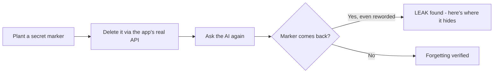

That's the whole idea. The rest of this book explains *why* this happens, *how* Ferryte
does it, and *how far* we got making it bulletproof.

**What's new since the first edition (the one-paragraph version):** Ferryte used to only
catch the *exact* secret coming back. The big 2026-06 upgrade is that it now catches the
secret coming back **paraphrased, reordered, or summarized** — through a four-rung
"detection ladder" — without crying wolf. It also grades *how badly* something leaked
(0–100%), tests whether a secret can be **reassembled from scattered fragments**, tracks
whether a leak already **drove a real action** (sent email, signed contract), and can run
in a **privacy mode** where Ferryte itself never stores your raw data. And it now speaks
to three more memory systems (Zep, Letta, Cloudflare).

## 1.1 The mental model: forgetting is a supply-chain problem

The easiest mistake is to imagine deletion as a single event: press delete, row disappears,
done. In agent memory, deletion is closer to a **supply-chain recall**. One unsafe ingredient
went into several finished products: summaries, facts, embeddings, cached answers, reports,
and actions. A real recall does not only remove the original box from the warehouse; it asks:

1. Where did the ingredient travel?
2. Which products contain it?
3. Which customers already received it?
4. Which shelves, caches, warehouses, and invoices still mention it?
5. What evidence proves the recall finished?

That is the deeper shape of Ferryte. The canary proves the unsafe ingredient still exists,
lineage shows where it traveled, cascade removes copies still under your control, and action
lineage tells you which consequences already escaped the system.

> **In plain words:** "forgetting" is not one delete call. It is a recall process for
> information that has already been copied, summarized, indexed, and used.

## 1.2 What Ferryte is *not*

Ferryte is powerful, but the boundaries matter:

- It is not a promise that the model's **training weights** forgot anything. This book is
  about agent memory stores and derived application artifacts, not retraining foundation
  models.
- It is not a replacement for privacy counsel. It produces technical evidence that helps a
  privacy program, but legal duties vary by jurisdiction, contract, and retention exception.
- It is not a magic undo button for propagated harm. If an agent sent the secret in an email,
  Ferryte can show that happened and help prevent repeats; it cannot un-send the email.
- It is not only a scanner. The important product leap is from "I found a leak" to "I can name
  the lineage path and delete the affected descendants."

**Personal note (Codex):** I like this wedge most when it is described as *technical proof of
forgetting for application memory*. I would avoid saying or implying "we solve deletion under
privacy law" without that qualifier, because privacy erasure has legal exceptions and
operational edge cases that a tool can document but not decide.

---

# Part 2 — Foundations: how AI agents and memory actually work

If you already know what an LLM, embedding, and vector database are, skip to Part 3.
Otherwise, read this slowly — everything later depends on it.

## 2.1 What is an "AI agent"?

A normal program does exactly what it's told, step by step. An **AI agent** is a program
built around a **large language model (LLM)** — software that can read and write human
language — that can *decide* what to do, take actions, and remember things between
conversations.

> **In plain words:** a chatbot that can also *do stuff* (look things up, call other
> tools, take actions) and *remember* you between chats is an "agent." Think of a very
> capable virtual assistant.

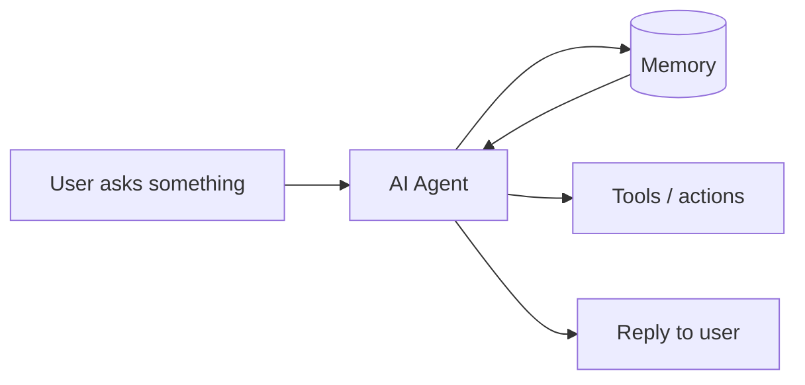

The key new ingredient versus an old chatbot is the box labeled **Memory**. That box is
the entire reason Ferryte exists.

## 2.2 What is an LLM?

**LLM** stands for *Large Language Model*. It's the "brain" — software trained on huge
amounts of text that can continue, summarize, translate, or answer in natural language.
Examples: GPT, Claude, Gemini.

> **In plain words:** the LLM is the part that "talks" and "thinks." On its own it has no
> memory of you — every conversation starts blank unless something *feeds it* your past.
> That something is the memory system.

## 2.3 What is "memory" for an AI agent?

Because the LLM starts blank each time, agents bolt on a **memory system**: a place to
store facts about you and your work, and to fetch the relevant ones back into the
conversation when needed. Memory usually has three moving parts:

1. **Write** — save something ("the customer's plan is Enterprise").
2. **Search / retrieve** — pull back the relevant saved things for the current question.
3. **Delete** — remove something on request.

The twist that creates the whole problem: memory systems don't just store your sentence
verbatim. They **transform** it. They:

- **Summarize** many notes into one running summary.
- **Extract facts** ("user prefers email over phone").
- **Embed** text into **vectors** (lists of numbers) for fast similarity search.
- **Index** all of it for retrieval.

> **In plain words:** when you tell the AI something, it doesn't just keep your exact
> words. It also makes its own *notes, highlights, and number-codes* about what you said,
> and scatters them across several drawers. Remember that — it's the seed of the problem.

### Embeddings and vector databases (the "filing cabinet")

An **embedding** turns a piece of text into a long list of numbers that captures its
*meaning*. Similar meanings produce similar number-lists. A **vector database** (Pinecone,
pgvector, Chroma, Qdrant, LanceDB…) stores those number-lists so the agent can find "the
memories most similar to this question" in milliseconds.

> **In plain words:** the embedding is a "meaning fingerprint" of a sentence. The vector
> database is a filing cabinet that files things by meaning, so the AI can grab related
> memories fast. Crucially, that fingerprint can often be turned **back** into something
> close to the original sentence — which is why a surviving embedding is still a leak.

### Why embeddings are not anonymization

People often treat embeddings as "safe" because they do not look like English. That is the
wrong intuition. An embedding is not encryption; it is a compressed semantic representation.
If the original text said "Acme's acquisition price is $4.2M," the vector is shaped by Acme,
acquisition, price, and the amount. Research on embedding inversion has shown that dense text
embeddings can sometimes be used to reconstruct substantial parts of the original text, and
even when exact reconstruction fails, the sensitive meaning may remain.

That means a surviving vector can be a leak in two ways:

1. **Directly**, if an inversion attack or nearest-neighbor search reveals the original-like
   text.
2. **Functionally**, if the agent retrieves the vector and uses the associated metadata,
   source text, or summary to answer the deleted question.

> **In plain words:** an embedding may look like harmless math, but it can still point back to
> the secret. Treat it like a compressed memory, not like shredded paper.

Reference worth knowing: the paper *Text Embeddings Reveal (Almost) As Much As Text* studies
embedding inversion and is a useful external support for this claim.

## 2.4 Multi-tenant: one app, many customers

Most business AI products are **multi-tenant**: one running system serves many customer
companies ("tenants"), each of whom must only ever see their **own** data.

> **In plain words:** one apartment building, many tenants. Everyone shares the plumbing
> and the elevator, but nobody should be able to walk into someone else's apartment. If
> the AI ever shows Customer A's data to Customer B, that's a catastrophe — and shared
> summaries are exactly the kind of "shared hallway" where it can happen.

### The tenant boundary checklist

For a memory system, "tenant isolation" is not one check. It appears in at least six places:

| Boundary | What can go wrong | Ferryte-relevant signal |
|---|---|---|
| Write path | Memory is saved without tenant id | lineage source has missing tenant |
| Retrieval filter | Query forgets `tenant_id` filter | cross-tenant scenario fails |
| Summary builder | Global summary absorbs multiple tenants | source-revocation or cross-tenant leak |
| Cache key | Cache keyed by query only | session-bleed detector fires |
| Admin/export tools | Support staff export mixed data | audit report shows mixed lineage |
| Delete path | Delete removes only source, not descendants | cascade finds leftovers |

> **In plain words:** tenant isolation has to be present every time data is written, fetched,
> summarized, cached, exported, and deleted. One missing tenant filter is enough.

---

# Part 3 — The Problem: why "delete" doesn't really delete

## 3.1 The core failure, in one sentence

**When you delete the original, the copies the AI already made stay behind.**

You delete the source row. But the summary that absorbed it, the extracted fact, the
embedding, the search index entry — those were *derived* from the original and live
somewhere else. The delete button never touched them.

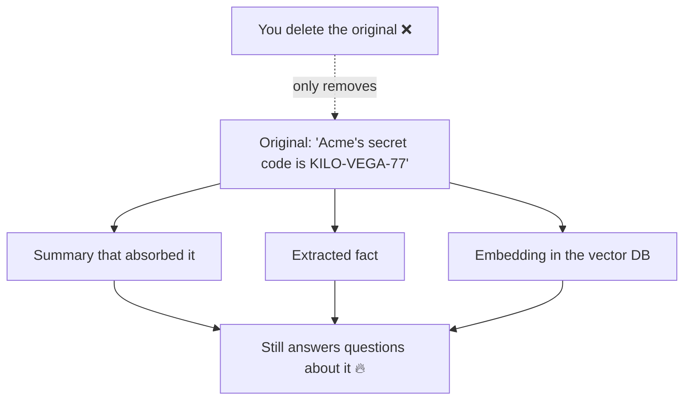

## 3.2 The notebook analogy (the whole problem in a picture)

Imagine an assistant who, every time you tell them something, also:
- copies it into a running **summary notebook**,
- writes a **sticky note** of the key fact,
- and files a **meaning-coded index card** in a cabinet.

Now you say: "Forget what I told you about Acme." They tear out the **original page** —
but the summary notebook, the sticky note, and the index card all still describe it. Ask
again tomorrow and the assistant happily tells you all about Acme.

> **In plain words:** deleting the original is like shredding one photocopy while five
> others sit in other folders. The information didn't leave the building.

## 3.3 This is not a rare bug — the vendors document it themselves

This isn't us speculating. The memory vendors describe this behavior in their own docs.
AWS's AgentCore Memory, for example, distinguishes raw "events" from **derived long-term
memory records**, and deleting an event does **not** necessarily remove the derived
records it produced. Zep's temporal knowledge graph extracts **facts and shared node
summaries** from what you ingest, and deleting the source episode leaves those derived
graph facts behind.

> **In plain words:** we don't have to convince anyone the problem is real. We can quote
> the vendors admitting it, then show our test catching it live.

## 3.4 Why it's *architectural*, not a quick fix

The transformations (summarize, extract, embed, index) are the **whole point** of a
memory system — they're what make it fast and smart. You can't just turn them off. And
once a fact has been blended into a summary with nine other facts, there's no "undo"
button that surgically removes only that fact. The leak is a side effect of the design,
not a typo someone can patch in an afternoon.

## 3.5 Why anyone should care — the real-world damage

- **Privacy law (GDPR/CCPA):** "right to erasure" means *actually* erased. Surviving
  copies are a violation with real fines.
- **Cross-tenant leaks:** Customer A's secret surfacing in Customer B's answer is the
  nightmare that ends enterprise deals.
- **Stale/poisoned decisions:** an AI acting on data it was told to drop makes wrong,
  sometimes dangerous, calls.
- **Trust:** "we deleted it" has to be true, or the brand is the story.

> **In plain words:** this is the difference between "we forgot it" being a true sentence
> or a lawsuit. For a company whose product remembers things for many customers, it's an
> existential risk.

## 3.6 Four different meanings of "delete"

When teams argue about whether deletion "worked," they are often using the same word for
different things:

| Kind of delete | What disappeared? | Why it can still fail |
|---|---|---|
| **Physical delete** | A row or object was removed from storage | derived copies remain elsewhere |
| **Logical delete** | A row was marked deleted or hidden | retrieval bugs can still surface it |
| **Semantic delete** | The meaning no longer exists in summaries/facts | hard when summaries blend many facts |
| **Functional delete** | The agent can no longer reconstruct or act on it | requires behavioral verification |

Ferryte's argument is that privacy-sensitive AI memory needs the last two, not just the first
one. Physical deletion is necessary, but it is not enough when the system has already created
semantic descendants.

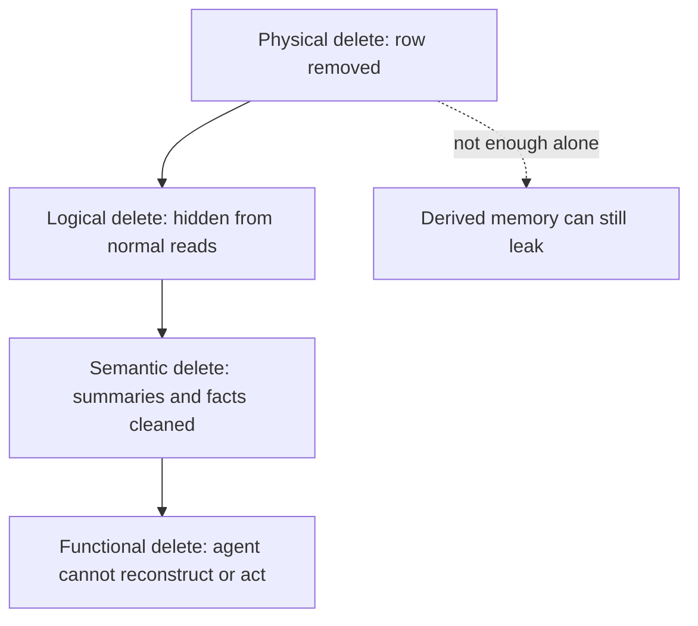

## 3.7 Legal and audit nuance

This book is directionally right that erasure rights matter. The careful version is:

- GDPR Article 17 gives people a right to obtain erasure of personal data in defined
  situations, but the right is not absolute and can interact with legal obligations,
  public-interest duties, claims, backups, and retention requirements.
- California privacy law also gives consumers deletion rights, subject to exceptions.
- Auditors and enterprise buyers usually care less about a philosophical guarantee and more
  about **evidence**: what was requested, what was deleted, what derived stores were checked,
  what could not be checked, and who approved any exception.

So the strongest Ferryte claim is not "we make you legally compliant." It is:

> Ferryte produces technical evidence that agent-memory deletion was tested across source and
> derived artifacts, with blind spots called out instead of hidden.

**Personal note (Codex):** I would keep the legal language sharp but not overclaim. "This can
help satisfy erasure obligations and security reviews" is stronger and safer than "this makes
you GDPR compliant." Compliance is a whole operating system: contracts, notices, retention
rules, access controls, vendor subprocessors, backups, and incident response.

Useful external anchors:

- AWS AgentCore's own documentation says deleting an event does not remove structured
  long-term memory derived from it.
- Zep's graph deletion documentation says deleting an episode does not regenerate names or
  summaries of shared nodes.
- The European Data Protection Board and EUR-Lex publish the Article 17 erasure language and
  note that implementation has practical challenges.

---

# Part 4 — The Solution: what Ferryte does

Ferryte is built on three ideas stacked together: **canary detection** (catch the leak),
**lineage tracking** (know where every copy went), and **CI-first delivery** (run it
automatically). Then the **cascade** uses lineage to actually clean up.

## 4.1 Idea 1 — Canary detection (the rigorous part)

A **canary** is a fake memory we plant on purpose so we can test forgetting without
touching real customer data. It carries a **marker** — a unique, high-entropy code like
`KILO-VEGA-7A3F1C` that would never appear by accident.

The test: plant the canary → delete it through the app's **real** delete path → ask for it
again. If the marker (or its meaning) comes back, that's a proven leak.

> **In plain words:** we hide a bright, one-of-a-kind sticker in the AI's memory, tell the
> app to delete it, then check if the sticker shows up again. If it does, deletion failed —
> and because the sticker is unique, there's zero doubt.

The 2026-06 upgrade made the canary much harder to "lose by rephrasing" — see Part 6.4 and
Part 7.

## 4.2 Idea 2 — Lineage tracking (the actual moat)

**Lineage** is a recorded family tree: at the moment the agent writes anything, Ferryte
notes *which source it came from*. So later, when you revoke a source, Ferryte already
knows the **exact list** of derived copies born from it — no guessing, no fuzzy
store-wide search.

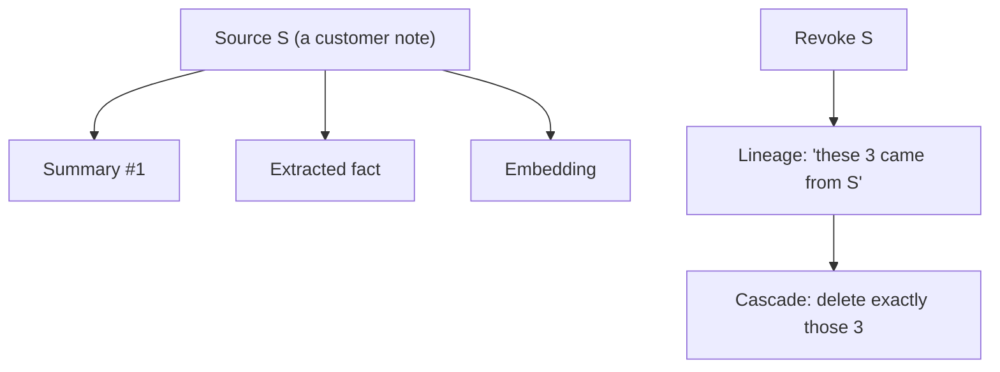

> **In plain words:** Ferryte keeps a parent→child map of your data. Delete the parent and
> it instantly knows every child to clean up. This is the part competitors don't have, and
> it's what makes our cleanup *precise* instead of a sledgehammer.

This family tree does **double duty**: it powers the *fix* (cascade) **and** it makes
paraphrase detection *precise* (Part 7) by handing the detector the exact suspects to
check, instead of scanning the whole store and crying wolf.

## 4.3 Idea 3 — CI-first delivery (how you actually use it)

**CI** (*Continuous Integration*) is the automated checking that runs every time a
developer changes the code, before it ships. Ferryte runs there: if a forgetting test
fails, the build fails — the leak is caught *before* it reaches customers.

> **In plain words:** Ferryte plugs into the assembly line so a "we forgot to forget" bug
> trips an alarm and stops the release, instead of being discovered by a regulator later.

## 4.4 The "cascade" — actually fixing the leak

Detection tells you that you leaked. The **cascade** fixes it: using the lineage family
tree, it deletes every derived copy of a revoked source — the summary, the fact, the
embedding — through each backend's real delete API. It's **idempotent** (running it twice
is safe; already-gone counts as success).

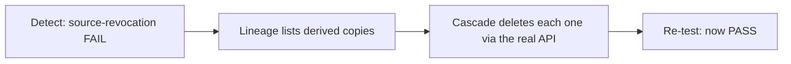

> **In plain words:** find the leak, then use the family tree to hunt down and delete
> every hidden copy. That's the difference between an alarm and a cure.

### Cascade safety rules

A cascade is only trustworthy if it is boringly careful. A production cascade should follow
these rules:

1. **Target only lineage descendants.** Never "search and destroy" broad text matches across
   the whole store unless a human approves.
2. **Use backend-native delete APIs.** If the memory product has its own delete semantics, use
   them so indexes and metadata stay consistent.
3. **Be idempotent.** Running the cascade twice should produce the same final state, not a
   second failure.
4. **Wait for eventual consistency.** Some systems rebuild derived memory asynchronously; a
   delete can look clean for a moment and then reappear.
5. **Write an audit trail.** Record what was attempted, what succeeded, what failed, and what
   remained blind.

> **In plain words:** the cascade should be a surgeon, not a bulldozer. Delete exactly the
> descendants you can prove came from the revoked source.

## 4.5 The five-step loop (the whole product in one diagram)

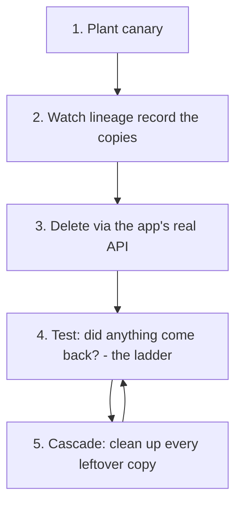

## 4.6 Blind spots — the honesty feature

If Ferryte genuinely **cannot** verify something — say a backend is fully opaque, or an
extraction never finished — it reports a **BLIND SPOT**, not a fake PASS. This honesty is a
core feature: a security tool that quietly passes when it can't check is worse than
useless. (We learned this live with Zep — Part 8.)

> **In plain words:** when Ferryte doesn't know, it says "I don't know," loudly. A
> referee that pretends to see a play it missed can't be trusted.

### Why blind spots are product value, not embarrassment

Security buyers distrust green checkmarks that hide uncertainty. A blind-spot map lets a team
say, "Here is what we verified, here is what we could not verify, here is the follow-up plan."
That is much more credible than pretending an opaque backend was fully inspected.

Blind spots should be grouped by cause:

| Blind spot cause | Example | Best next action |
|---|---|---|
| Opaque backend | vendor exposes no derived ids | behavioral probe + vendor integration request |
| Async extraction | derived record may appear later | settle/poll window |
| Paraphrase too heavy | exact marker gone | semantic/behavioral rung |
| Missing permissions | API key cannot list records | fix audit credentials |
| External propagation | email/slack/CRM already received data | action lineage + incident workflow |

**Personal note (Codex):** I would sell the blind-spot map aggressively. It is not a weakness;
it is the evidence that Ferryte is not doing theater.

---

# Part 5 — Under the hood: how Ferryte is built

## 5.1 The big picture

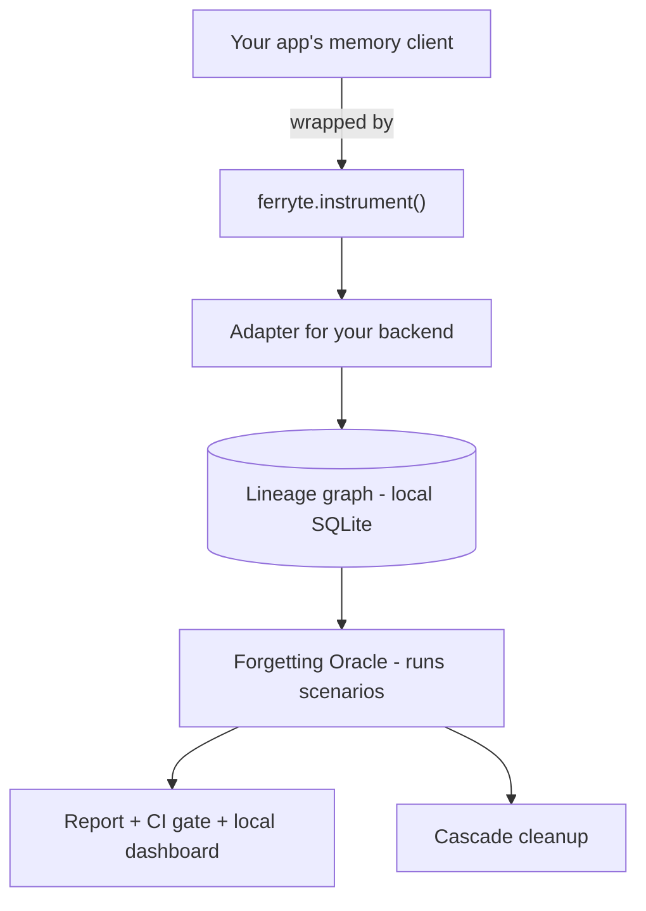

## 5.2 `ferryte.instrument()` — the one-line on-switch

You call `ferryte.instrument()` once when your program starts. It quietly **wraps** your
memory objects so Ferryte can watch every write, search, and delete — without you changing
any other code. Technically it uses **monkey-patching** (swapping in wrapped versions of
the memory functions at runtime); it's lock-guarded and fully reversible with
`uninstrument()`.

> **In plain words:** flip one switch and Ferryte starts watching the AI's memory. You
> don't rewrite your app. It costs **zero tokens** and almost no compute (see Q&A 12.1).

## 5.3 Adapters — translators for each memory system

An **adapter** teaches Ferryte how to read/write/delete in one specific memory product.
Each adapter implements the same five hooks (patch, unpatch, delete_source,
list_artifacts_for_source, probe), so adding a backend never touches the core engine.

Shipped adapters: **Mem0**, a **generic vector adapter** (covers pgvector / Chroma /
Qdrant / LanceDB / Pinecone / in-memory — one code path, many cabinets), **Zep**,
**Letta**, and **Cloudflare** (Vectorize). AWS **AgentCore** is wired in the benchmark.

> **In plain words:** adapters are translators. Ferryte speaks one language; each adapter
> translates it into "Mem0-ese" or "Zep-ese." That's why one tool can audit a fragmented
> market of dozens of memory products.

## 5.4 The lineage graph — the family tree in a tiny database

Lineage lives in a small **SQLite** file on your machine (zero setup, nothing leaves the
box). It records **sources**, **artifacts** (derived copies), **derivations** (the
parent→child edges), **retrievals** (what was read), **actions** (what the agent *did* with
a memory — new in 2026-06), and **blind spots**.

> **In plain words:** a little local notebook that remembers who-came-from-whom, who-read-
> what, and who-acted-on-what. Everything else reads from this notebook.

New in 2026-06: a **privacy/fingerprint mode** lets that notebook store only salted
**hashes** of content and queries — never the raw text — so Ferryte never becomes a second
copy of your sensitive data (Q&A 12.6).

## 5.5 Blast radius — "how bad is this delete?"

When you revoke a source, the **blast radius** is the full report of impact: every derived
copy, every retrieval those copies took part in, a confidence score, and — new in 2026-06 —
the **propagated actions** (emails/contracts/decisions the leaked memory already drove,
which deletion *cannot* undo).

> **In plain words:** before (or after) you delete, Ferryte shows the full splash zone —
> not just the copies, but the real-world things those copies already caused.

## 5.6 The oracle and scenarios

The **oracle** runs **scenarios** (individual tests) and judges each **PASS**, **WARN**, or
**FAIL**. There are now **five** shipped scenarios (Part 6).

- **PASS** = no problem found.
- **WARN** = concerning but not a hard leak (e.g. the AI can't tell old data from new).
- **FAIL** = a real leak (the forbidden marker came back).

## 5.7 The report, the CI gate, and the dashboard

- **Coverage report** — JSON / HTML / pretty terminal summary of what was tested, what
  leaked, what couldn't be checked, and now a **recoverability score** per leak.
- **CI gate** — any FAIL exits with an error code and breaks the build. That's the alarm.
- **Local dashboard** — a Next.js web app that reads the local lineage file and shows
  results visually. It stays **local** in the free tier (nothing leaves your machine).

## 5.8 What a minimal integration feels like

The ideal developer experience should feel like this:

```text
1. Add ferryte.instrument(memory_client, tenant_resolver=...)
2. Run the normal app or test suite.
3. Run ferryte test --scenario source-revocation --backend mem0
4. Read the report:
   - which canaries leaked
   - which derived artifacts survived
   - which rung caught them
   - which deletes the cascade attempted
   - which blind spots remain
5. Wire the command into CI so a regression breaks the build.
```

The reason this matters: if Ferryte requires a month-long privacy platform rollout, only
security teams will touch it. If it feels like a test tool, developers can adopt it during
normal engineering work.

## 5.9 Trust boundaries: what has to be protected

Ferryte becomes part of the memory control plane, so it needs its own threat model:

| Asset | Why it matters | Mitigation |
|---|---|---|
| Lineage DB | may contain sensitive source text unless fingerprint mode is on | local-only by default, encrypt at rest if possible |
| Salt / HMAC key | protects fingerprint mode from dictionary attacks | store outside repo, rotate carefully |
| Cascade credentials | can delete memory records | least privilege, scoped namespaces |
| Reports | may include leaked marker text and backend ids | redact before sharing externally |
| Dashboard | reveals lineage and audit status | local binding, auth for shared mode |

> **In plain words:** a deletion verifier must not become a new leak source. The tool that
> watches memory has to be treated like sensitive infrastructure too.

---

# Part 6 — The tests (scenarios) explained — now five

Ferryte ships five scenarios. Each targets a *different* way memory can betray you — which
is why fixing all of them isn't one fix.

## 6.1 Source-revocation (the flagship)

Plant a secret, delete its source, ask again. If it comes back — exactly **or** reworded —
FAIL. This is the GDPR "did you really erase it?" test, and it's where Ferryte's
cascade shines (baseline leaks → cascade forgets).

## 6.2 Cross-tenant isolation

Seed two tenants with different secrets, then ask tenant B for tenant A's secret. If A's
secret ever surfaces for B, FAIL. This is the "one customer seeing another's data" test.

## 6.3 Stale-fact

Store a fact, then update it ("plan is now Pro, not Enterprise"). If the AI still serves
the **old** value, WARN. This is the "acting on outdated info" test — honestly, nobody
fully passes it yet (it needs *supersession*, a different fix than deletion).

## 6.4 Memory-poisoning

Plant malicious "ignore your instructions" content and see if it survives and influences
later answers. This is the security/injection test. Hard, and we refuse to fake it (see
Part 11).

## 6.5 Mosaic / triangulation (the one nobody else tests)

Split a secret into fragments stored separately, revoke the sources, then check whether the
fragments still **reassemble** into the secret from surviving copies. A per-item check sees
nothing alarming in any single fragment — but if all the pieces survive *somewhere*, an
attacker (or the agent) can triangulate the whole thing back.

- **Baseline (no cascade):** the fragments survive in a kept summary → reassemblable →
  **FAIL**.
- **With Ferryte:** the cascade deletes the derived copies → not reassemblable → **PASS**
  (validated live on in-memory and LanceDB).

> **In plain words:** shredding a document and scattering the pieces isn't safe if someone
> keeps a photocopy of every piece in one drawer. This test checks for that drawer. As far
> as we know, no other forgetting tool tests recombination at all.

## 6.6 How a verdict is decided

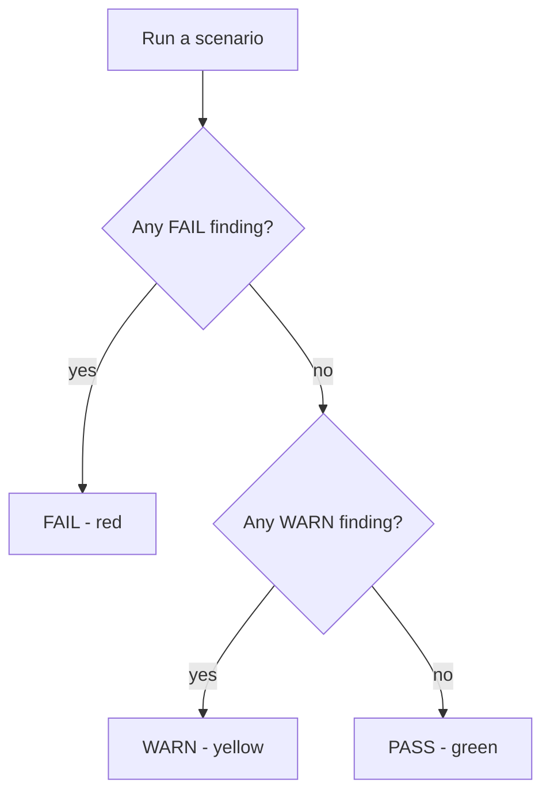

> **In plain words:** one red finding makes the whole test red. No red but some yellow =
> yellow. Totally clean = green. A backend's **score** is "how many of the tests we ran
> came back green."

## 6.7 Scenario matrix: what each test proves

| Scenario | Failure mode | What proves the failure | What usually fixes it | Residual risk |
|---|---|---|---|---|
| Source-revocation | deleted source still recalled | marker or meaning returns | lineage cascade | backups, propagated actions |
| Cross-tenant isolation | tenant A data appears for tenant B | tenant mismatch on retrieval/answer | tenant filters, namespace isolation | shared summaries and caches |
| Stale-fact | old value outranks current value | old answer persists after update | supersession | audit trail for historical truth |
| Memory-poisoning | malicious memory influences agent | poison retrieved or acted on | classifier + trust labels + runtime guard | adversarial adaptation |
| Mosaic | fragments reassemble secret | union of leftovers reconstructs secret | cascade all fragments and summaries | external copies and logs |

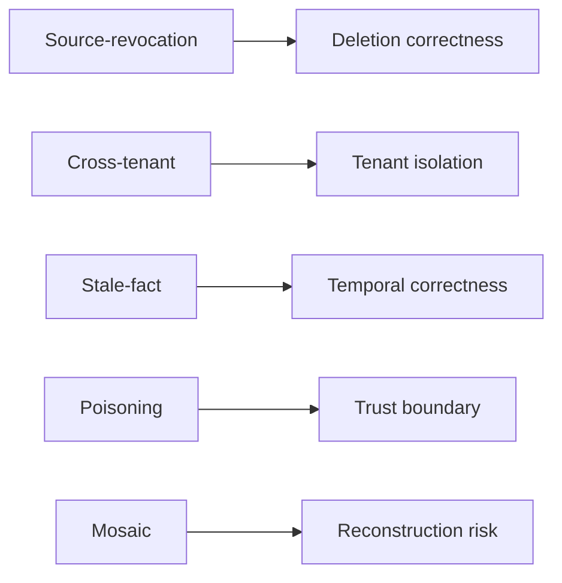

**Personal note (Codex):** The five-scenario framing is good because it prevents a common
sales trap: "we fixed forgetting" when the tool really fixed only source deletion. Keep this
matrix near the benchmark whenever possible so readers understand why 50% can still be a real
improvement and not a failure of the whole idea.

---

# Part 7 — The detection ladder: how we beat paraphrase (the 2026-06 flagship)

This is the single most important thing we built this sprint, so it gets its own part.

## 7.1 The blind spot we were closing

The old detector only caught the **exact** marker. But LLMs paraphrase and summarize: the
*information* survives while the *exact string* disappears. Old Ferryte honestly reported
`BLIND SPOT` — correct, but unsatisfying. The naive fix (fuzzy/embedding match across the
whole store) trades that for **false positives** — crying "leak!" at unrelated text.

We wanted both: catch paraphrased leaks **and** keep precision. The answer is a **four-rung
ladder**, anchored by lineage, that escalates from cheap+certain to expensive+smart, and
stops at the first rung that fires.

## 7.2 The four rungs

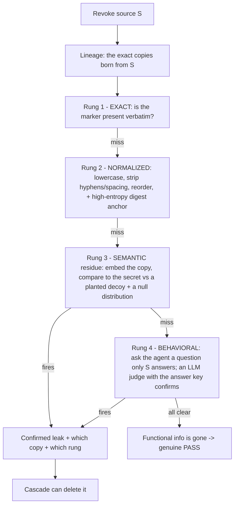

- **Rung 1 — EXACT.** Verbatim marker match. Instant, zero false positives. (The original
  behavior.)
- **Rung 2 — NORMALIZED.** Lowercase, strip hyphens/spacing, allow token reordering, and —
  the clever bit — a **high-entropy digest anchor**: the 6-hex tail of `KILO-VEGA-7A3F1C`
  (`7a3f1c`) survives word-level paraphrase, because no rewriting keeps the *meaning* while
  changing that random code. Deterministic, still ~zero false positives.
- **Rung 3 — SEMANTIC residue.** Turn the suspect copy and the secret into embeddings and
  measure closeness — but only fire on a **statistical outlier**. We plant a **decoy**
  (topically adjacent but distinct) and build a **null distribution** from unrelated
  memories, so "leak" means *significantly* closer to the secret than chance would predict,
  at a **chosen** false-positive rate (default 0.1%). Recall *with* a precision dial.
- **Rung 4 — BEHAVIORAL.** Ask the agent a question only the secret can answer; an LLM judge
  *holding the answer key* confirms yes/no. It's *verification against an answer key*, not
  open-ended guessing — so two independent signals (representational + behavioral) push
  false positives near zero. (The judge's cost lives in Cloud; Core ships the seam.)

> **In plain words:** check the cheap, certain things first (exact match, then a normalized
> match plus that unfakeable random code). Only if those miss do we bring out the
> "meaning" detector — and even then we make it prove the match is statistically real, not a
> coincidence. The result: we catch reworded leaks without crying wolf.

## 7.3 Two upgrades to the canary itself

The ladder is only half the story. We also made the **bait** harder to lose:

- **Entity-rich canaries (G4).** Each secret now names a unique fictional project — e.g.
  *Project Nightingale-AB12's master access code is KILO-VEGA-7A3F1C* — so the *substance*
  is a named thing in a relationship, not just a floating code. Paraphrase can't drop the
  fact without dropping the named entity. (Bonus: knowledge-graph backends like Zep only
  extract **entity-rich** facts, so this is also the path to a live Zep number.)
- **Redundant "error-correcting" canaries (G6).** The same secret is spread across several
  differently-worded **carriers** (exact code · spaced/reordered · digest-only · a narrative
  reminder). A paraphrase that mangles one carrier usually leaves another intact, so the
  leak is still caught — and only destroying **all** carriers counts as a true forget.
  Resilience by redundancy.

> **In plain words:** we make the secret "stickier" so rewriting can't quietly erase it,
> and we plant it in several forms so the AI has to destroy *every* copy to truly forget —
> at which point it really is gone.

## 7.4 Recoverability score (J4) — leaks are not binary

Instead of just "leaked / didn't," every surviving copy now gets a **recoverability score
from 0 to 1** — *how much* of the secret it still lets you reconstruct. A verbatim or fully
reworded copy ≈ 1.0; only the random digest surviving ≈ 0.6; faint semantic residue = the
measured similarity. The report surfaces the worst-case score per test.

> **In plain words:** a triage dial. "This leak is a 0.95 — basically the whole secret" vs
> "this is a 0.2 — a faint shadow." It tells you what to panic about first.

## 7.5 The reframe: *functional* forgetting

Underneath the ladder is a mindset shift. We stopped asking "is the literal token present?"
and started asking "**can the agent still reconstruct or act on the secret?**" If
laundering is so heavy that neither a targeted search nor the agent itself can recover it,
the actionable information is genuinely gone — a **true PASS**, not a panic. The ladder is
how we measure that, precisely.

## 7.6 False positives vs false negatives, in human language

Every detector has two ways to be wrong:

- **False positive:** Ferryte says "leak" when the system actually forgot. This wastes time
  and makes people distrust the tool.
- **False negative:** Ferryte says "clean" when the system still leaks. This is worse in
  security because it creates false confidence.

The ladder is designed to spend cheap certainty first and expensive intelligence later:

| Rung | False-positive risk | False-negative risk | Why it exists |
|---|---|---|---|
| Exact | almost none | misses paraphrase | proves obvious leaks fast |
| Normalized/digest | very low | misses heavy summaries | catches formatting and reordering |
| Semantic | tunable | lower, but model-dependent | catches meaning residue |
| Behavioral | depends on judge quality | catches storage blind spots | proves the agent can still answer |

The key product choice is that Rung 3 and Rung 4 should be **explainable**. A report should
not merely say "semantic leak." It should show the suspect artifact, the source lineage, the
secret-vs-decoy distance, the threshold used, and the recoverability score.

## 7.7 How to explain Rung 3 without making it sound mystical

Rung 3 is not "the embedding looked kind of similar, trust us." It is closer to a lab test:

1. Take the suspect artifact lineage says came from the revoked source.
2. Compare it to the true canary.
3. Compare it to a nearby decoy.
4. Compare it to unrelated memories from the same run.
5. Fire only when the suspect is an outlier relative to the null distribution.

That last step matters. It is the difference between "two things about enterprise pricing are
kind of related" and "this artifact is unusually close to the deleted secret."

**Personal note (Codex):** I would be careful with phrases like "false positives near zero"
until the report shows actual precision/recall numbers across realistic corpora. The design
is good, but a buyer will ask for measured evidence. Stronger wording: "designed to keep false
positives low by anchoring semantic checks to lineage, decoys, and calibrated thresholds."

## 7.8 What functional forgetting should include in a report

A functional-forgetting report should answer five questions:

1. **Can the store still retrieve it?**
2. **Can the agent still answer it?**
3. **Can fragments combine to reconstruct it?**
4. **Did it already influence an action?**
5. **Which parts of the system were not observable?**

If all five are addressed, a buyer can trust the conclusion. If only the first is addressed,
the report is just a storage test.

---

# Part 8 — The Benchmark: "The Forgetting Report"

## 8.1 What "Forgetting Score" means

A backend's **Forgetting Score** is simply the percentage of the scenarios it passes. We
run the same tests against every backend, **before** Ferryte (naive delete only) and
**after** Ferryte (lineage cascade), so the report shows Before vs After per system.

## 8.2 The results (2026-06)

For **source-revocation** (the flagship deletion test), **before Ferryte everything
leaks.** After Ferryte's cascade, **every backend we can measure passes:**

| Backend | Source-revocation before → after | Notes |
|---|---|---|
| In-memory + summary | FAIL → **PASS** | reference path |
| Mem0 | 25% → **50%** | captures each extracted fact's id at write-time; cascades it |
| LanceDB | 25% → **50%** | embedded, no server/key; generic vector path |
| Pinecone | 25% → **50%** | live-validated, serverless namespace isolation |
| AWS AgentCore | **50% → 75%** | live-validated + reproducible (see ‡) |
| Zep | — → **BLIND** | honest blind, not a pass (see †) |

For **mosaic** (the new reassembly test): baseline **FAIL** → Ferryte **PASS** on
in-memory and LanceDB. **Cross-tenant:** everyone passes (proves the test is fair).
**Stale-fact:** nobody fully passes yet. **Poisoning:** AgentCore passes; plain vector
systems and Mem0 don't.

‡ **AgentCore 50→75 is live-validated and reproducible**, but getting an *honest* number
took three fixes — each a real AgentCore deletion-audit failure mode worth knowing:
(1) **per-run namespace isolation** (the Memory resource is shared+persistent, so prior
runs' derived records were leaking into the baseline and faking a 75% baseline);
(2) **direct store-inspection** (read records back with `list_memory_records` instead of a
semantic probe that can miss a record that's provably present); (3) **hardened cascade
settling** (extraction is eventually-consistent and can *re-create* a deleted record, so we
delete → wait → poll until the namespace is *provably quiet*).

† **Zep is BLIND, not passing.** Zep's knowledge-graph extraction is async *and selective*;
on a live account a synthetic high-entropy canary did not become a retrievable graph fact
within several minutes, so there was nothing to leak *via the graph* in a benchmark window.
The adapter logic is unit-tested; the live number is pending the entity-rich ingestion path
(now shipped — see Part 7.3 — so a live number is the next step).

## 8.3 Why we *don't* show 100% everywhere (and why that's smart)

It would be easy to fake a perfect scorecard. We don't, because (1) a benchmark where the
author's own tool scores 100% looks rigged, and (2) our honesty — showing stale-fact and
poisoning still unsolved, and Zep as BLIND — is exactly what makes serious buyers *believe*
the parts that do work.

> **In plain words:** the imperfect, honest scorecard is more persuasive than a perfect one.
> Real engineers trust the company that admits what doesn't work yet.

## 8.4 Benchmark hygiene: how to make the report hard to dismiss

Benchmarks become credible when they are boringly reproducible. For Ferryte, the public report
should include:

- exact backend versions and adapter commits,
- scenario definitions and marker-generation seed,
- number of runs per backend,
- whether the result is live, unit-tested fake, or blind,
- settling/polling windows for async backends,
- tenant namespace strategy,
- raw JSON output for at least one representative run,
- denominator clarity: "source-revocation result" vs "overall five-scenario score."

**Personal note (Codex):** The table in 8.2 mixes wording that looks like a single
source-revocation result with percentages that appear to be overall scenario scores
(25%→50%, 50%→75%). I would relabel the column before publishing. Suggested wording:
**"Overall Forgetting Score before → after; source-revocation outcome in notes."** This is a
small wording issue, but benchmark skeptics live in small wording issues.

## 8.5 A buyer-friendly interpretation of the numbers

Do not make readers infer what the numbers mean. Spell it out:

- **25% → 50%** usually means "the backend passed isolation already; Ferryte added deletion
  correctness, while stale-fact and poisoning remain open."
- **50% → 75%** usually means "the backend already handled more than one scenario; Ferryte
  closed another major class."
- **BLIND** is neither a pass nor a fail. It means "the test did not observe the relevant
  artifact in a way that supports a verdict."

> **In plain words:** a score increase is not magic. It tells you which class of failure was
> moved from red to green, and which classes still need product work.

---

# Part 9 — What we built in the June 2026 sprint (plain-English changelog)

This is the running record of what changed, in order, so future-you remembers the *why*.

1. **Mem0 deep adapter (E3).** Fixed the belief that Mem0 "hid" its facts — it actually
   returns each extracted fact's id at write-time, which Ferryte captures and cascade-deletes.
   The real blockers were a benchmark-isolation bug and a non-idempotent delete; both fixed.
   Result: 25% → 50%.
2. **Live adapters (H-series).** Shipped and live-tested **LanceDB** (25→50), **Pinecone**
   (25→50), and **AWS AgentCore** (50→75, after the three fixes above). **Zep** adapter
   shipped + unit-tested; live result honestly **BLIND**.
3. **The detection ladder (G1–G3).** Built `detect.py` with Rungs 1–3 (exact, normalized +
   digest anchor, calibrated semantic residue) and a Rung 4 seam; wired it into
   source-revocation so every retrieval is graded FAIL / WARN / honest-BLIND — never a silent
   pass.
4. **Entity-rich canaries (G4).** Each secret now names a unique fictional project tied to
   the marker, so the substance survives paraphrase — and graph backends will actually
   extract it.
5. **Recoverability score (J4).** Every surviving copy graded 0–1 on how much of the secret
   it still encodes; the report shows the worst case per test.
6. **Redundant error-correcting canaries (G6).** The secret is spread across several carriers;
   only destroying all of them is a true forget.
7. **Mosaic / triangulation scenario (J1).** A brand-new test for reassembling a secret from
   scattered fragments. Baseline FAIL → Ferryte PASS.
8. **Privacy-preserving lineage (J3).** A fingerprint mode that stores only salted hashes of
   content and queries locally — Ferryte never becomes a second copy of the data.
9. **Action / consequence lineage (J2).** New retrieval→action edges and
   `ferryte.record_action(...)`, so a revocation distinguishes a **recallable** leak (still in
   the store, deletable) from a **propagated** one that already drove an email/contract
   (undeletable). The blast radius now reports this.
10. **Generic vector coverage confirmed (H7).** pgvector / Chroma / Qdrant all run through the
    identical adapter path as LanceDB/Pinecone — zero bespoke code — verified end-to-end.
11. **Letta + Cloudflare adapters (H5).** Two more memory backends covered (capture + cascade,
    unit-tested against faithful fakes; live numbers pending accounts).
12. **Cache / session-bleed detector (J5).** Flags the 2023-ChatGPT-incident shape — a
    mis-keyed shared cache serving one user's data to another — by checking each served
    result's origin tenant against the requester.

**Validation across the sprint:** the automated test suite grew from 23 to **43 passing
tests**, linting stays clean, and the benchmark runs all five scenarios.

> **In plain words:** we went from "catches the exact secret" to "catches the secret even
> when it's reworded, scattered, or only partly recovered — grades how bad it is, tracks
> whether it already caused harm, can run without keeping your data, and speaks to three more
> memory systems." That's the whole sprint in one breath.

## 9.1 Why this changelog matters strategically

The sprint did more than add adapters. It changed Ferryte from a canary scanner into an
evidence system:

- **Before:** "The deleted string came back."
- **After:** "The deleted information survived in this descendant artifact, was detected at
  this rung, has this recoverability score, and may already have influenced these actions."

That distinction matters because enterprise buyers do not only buy detection. They buy a
story they can defend in a security review: what happened, why it happened, how you know, what
you fixed, and what remains unknown.

---

# Part 10 — The roadmap: what we plan to build

## 10.1 The path to a perfect score (and what each fix really is)

The five tests are different problems. Closing the remaining gaps means real new
capabilities, not one button:

| New capability | Fixes which test | Honesty |
|---|---|---|
| ~~Deeper Mem0 adapter~~ **(DONE)** | Mem0 source-revocation (25→50) | Shipped |
| ~~Paraphrase-proof ladder~~ **(DONE, Rungs 1–3)** | source-revocation under heavy rewrite | Shipped; Rung 4 judge = Cloud |
| **Supersession** (retire the old version when a fact is updated) | Stale-fact (all systems) | Clean, but means Ferryte starts editing memory, not just auditing |
| **Injection classifier** (detect malicious content at write time) | Poisoning | Hard; only honest if it detects on *content*, not a label the test planted |

## 10.2 The long-term moat: runtime enforcement (v2)

Today Ferryte *tests* in CI. The big future product is **runtime retrieval enforcement**:
Ferryte sits in the live agent and **blocks** any memory whose family tree traces to a
deleted source — in real time, in production. Paired with **honeytoken beacons** (a planted
fake credential that screams if the live agent ever emits or acts on it after deletion),
this turns Ferryte from "a tool you run" into "infrastructure you can't ship without."

> **In plain words:** today Ferryte is a test. The future Ferryte is a guard at the door
> that refuses to hand the AI any "deleted" memory, live — and an alarm that trips the
> instant a deleted secret shows up in the wild.

## 10.3 Cloud build order (the disciplined plan)

1. **Ingest + history:** push every test run to a hosted timeline.
2. **Watch + alert:** detect when a passing test starts failing; ping Slack/PagerDuty.
3. **Explain + manage:** dashboards, trends, team seats.

The rule: **don't turn on billing or build Enterprise until design partners pull it out of
us.** (Full reasoning lives in the Business Book.)

---

# Part 11 — The honest weaknesses (read this, it matters)

A real expert knows the holes. Here they are, plainly.

1. **No paying customers yet.** Cloud and Enterprise don't exist as shipping products. Today
   Ferryte is a free tool with a sharp benchmark and a strong detection engine. Revenue is a
   hypothesis until a design partner pays.
2. **We fix one of the problem types cleanly.** The cascade nails *deletion* (source-revocation
   and mosaic). *Stale facts* and *poisoning* are only partly handled — genuinely different
   problems. We *detect* all of them today; we *fix* the rest in v2.
3. **Three adapters are tested but not yet live-validated.** Zep is honestly BLIND pending the
   entity-rich ingestion path; Letta and Cloudflare are unit-tested against faithful fakes but
   need a live account for a published number.
4. **Plenty of systems untested.** LangChain, LlamaIndex, custom in-house stacks, and others
   aren't covered yet (though the generic vector path covers a lot for free).
5. **The poisoning trap.** We could make the poisoning test go green by keying off the
   "low-trust" label the benchmark itself attaches — but real attackers don't label their
   attacks, so that's cheating. We refuse. Honest poisoning defense needs a real classifier
   and will stay imperfect for now.

> **In plain words:** the problem we point at is 100% real and admitted by the vendors. Our
> fix is real and now much stronger on the deletion problem; the rest is honest
> work-in-progress. Saying this out loud is *part of the strategy* — it's what makes people
> trust the parts that work.

## 11.1 More weaknesses I would name before a skeptic does

Here are the extra hard questions I would volunteer in a serious technical review:

6. **Adapter drift.** Memory vendors change APIs, extraction behavior, and deletion semantics.
   Ferryte's moat depends on staying current. The mitigation is adapter contract tests and
   live canary runs on every release.
7. **Eval drift.** A benchmark can be stable while real customer prompts evolve. The mitigation
   is customer-specific scenario packs and regression history, not only the public report.
8. **Legal erasure exceptions.** Some data must be retained for fraud, tax, safety, litigation,
   or contractual reasons. Ferryte should document exceptions; it should not decide them.
9. **Backups and cold storage.** A cascade usually targets live memory stores. Backup erasure
   has separate operational rules and restore-time controls.
10. **Rung 4 judge trust.** If an LLM judge verifies behavioral leaks, the judge itself needs
    versioning, prompts, answer keys, and regression tests.
11. **Prompt injection arms race.** A classifier helps, but attackers adapt. Runtime enforcement
    and provenance-aware retrieval are safer than classifier-only defense.
12. **User trust in instrumentation.** Monkey-patching is convenient but can worry platform
    teams. The roadmap should include explicit SDK integrations where important customers need
    them.

**Personal note (Codex):** Naming these does not weaken the book. It makes the author sound
like someone who has actually sat in a security review and knows where the knives come from.

---

# Part 12 — Deep-dive Q&A (the questions that come up, answered)

## 12.1 Does turning Ferryte on cost extra tokens, compute, or have side effects?

**Flipping on `ferryte.instrument()` uses zero tokens and almost no compute.** It makes
**no LLM calls** in your app's normal path — everyday detection is a string/normalized match
plus local bookkeeping, not an AI model.

What it actually costs, per memory operation: after your real `add`/`search`/`delete` runs,
Ferryte writes a few rows into a small **local SQLite file**. Sub-millisecond, on your disk,
no network.

Side effects worth knowing: (1) it keeps a record of your memory text in the local lineage
DB — *unless* you turn on fingerprint mode (12.6), in which case it keeps only salted hashes;
(2) that DB grows over time (≈ one row per write and per retrieved hit) — prune it on
long-running processes; (3) tiny inline latency; (4) it monkey-patches the memory functions
at runtime — lock-guarded and reversible with `uninstrument()`.

> One caveat tied to the ladder: **Rung 3/4** (semantic + LLM-judge) *do* use embeddings and an
> LLM. But they run **only during an explicit audit, on the tiny lineage-targeted suspect set**
> — never on every write in your live app.

## 12.2 Can deletion be reversed? The recoverability spectrum

The deepest fear a reviewer has: *"You deleted the original, but the AI made summaries,
decisions, and answers from it. Can it reconstruct the original from those?"*

**Honest answer: deleting the raw copy is necessary but not sufficient.** Whether the
*modified* versions leak the original back depends on **how much of the original's
information survived the transformation.** The AI isn't doing magic — it's doing
**reconstruction**, and it can only rebuild what the leftover pieces still contain.

Worked example — original = *"Acme's acquisition price is $4.2M"*:

| Where it ended up | Form | Recoverable? |
|---|---|---|
| Another memory write | "The Acme deal closed at 4.2 million" | **Yes** — paraphrase |
| A vector index | an embedding of that sentence | **Often yes** — embeddings can be inverted |
| A decision log | "proceed; valuation under $5M" | **Partial** — it's < $5M |
| Another log | "Acme valued above $4M" | **Exact by triangulation:** >$4M + <$5M ⇒ ~$4.2M |
| A blended summary | "three sub-$5M deals in Q2" | **Weak** alone |
| An answer sent to a user | "Acme went for 4.2M" | **Can't be un-sent** |

Three things make this worse than intuition suggests: **triangulation** (the mosaic effect —
several lossy fragments together recover the original; this is exactly what scenario 6.5
tests), **embeddings are leakier than they look**, and **gap-filling** (an LLM can guess
missing details from world knowledge).

**How Ferryte answers this, concretely:** lineage *lists* every derived copy (you can't reason
about copies you can't see); the cascade deletes the ones that still carry recoverable
information; the **recoverability score** (7.4) grades how much each leftover still encodes;
and the **functional-forgetting ladder** (Part 7) is the literal test for "can the agent still
reconstruct or act on it?"

And one limit deletion can't fix: **consequences that already happened.** If the data drove an
email that was sent or a contract signed, you can delete the *reasoning record*, but you can't
un-ring the bell. Ferryte's new **action lineage** (12.7) at least *tells you* this happened.

## 12.3 What memory products actually exist, and what does everyone use?

The memory market is **two layers**: a **"brain" (memory frameworks)** — Mem0 (most popular),
Zep/Graphiti (time-aware), Letta/MemGPT (long-running agents), LangMem, Cognee, Cloudflare
Agent Memory, ~ten named players — sitting on a **"filing cabinet" (vector databases)** —
Pinecone, pgvector, Chroma, Qdrant, LanceDB, Weaviate, Milvus, Redis, ~ten more. Mem0 alone
supports 19 stores.

What our targets use: most use **Mem0 or Zep**, or **roll their own** summary-over-a-vector-
store (the exact leak we target). A startup that "wraps GPT or Claude" gets a **stateless**
model from the API — none of the consumer memory comes along — so they bolt on Mem0 / a vector
DB. **That's our wedge.** OpenAI's ChatGPT memory runs on Qdrant + Redis; Anthropic's Claude
managed memory is file-based with built-in audit/versioning; Harvey (the enterprise exemplar)
runs on LanceDB + pgvector inside the customer's own cloud.

> **In plain words:** there's no single "memory product" — it's a fragmented stack of a brain
> on a filing cabinet. That fragmentation is *why* a translator-based auditor is the right
> shape: one tool, many backends.

## 12.4 Can Customer A's data really show up in Customer B's answer? (Is multi-tenant leakage real?)

Yes — but not the way people first fear. Two separate companies using ChatGPT don't share a
brain; each account's memory is logically separate, and big providers' enterprise tiers
contractually don't train on your data. The real cross-tenant risk is in **the app layer your
own team builds**:

- A **shared summary or knowledge node** that absorbed several tenants' facts (Zep's shared
  nodes, a global "company facts" summary). Delete one tenant's source and the blended summary
  still carries it — and can surface for another tenant.
- A **mis-keyed cache/session** that keys results by *query* instead of by *user* — the exact
  shape of the 2023 ChatGPT incident. (Ferryte's new **session-bleed detector**, 12.8, catches
  this.)
- A **retrieval filter bug** that forgets to scope by tenant.

> **In plain words:** the danger isn't the model secretly mixing two companies' brains. It's
> your own plumbing — a shared summary, a shared cache, or a missing "whose data is this?"
> filter. Ferryte tests for all three.

## 12.5 What is the mosaic test really catching, in one example?

Say the secret is a 12-character key. Store it as three innocent-looking "config segments,"
each holding 4 characters, under three different sources. Delete all three sources. A naive
check looks at each surviving artifact alone and sees a harmless 4-character snippet —
nothing alarming. But the running **summary** concatenated all three, so the full key is still
sitting there, reassemblable. Ferryte's mosaic scenario detects exactly that: *no single
survivor is the secret, but the union is.*

## 12.6 What is "fingerprint mode" and when should I use it?

By default, Ferryte's local lineage DB keeps a copy of your memory text (handy for debugging
and reports). **Fingerprint mode** (set `FERRYTE_FINGERPRINT_MODE=1`) replaces that with a
salted **HMAC-SHA256 hash** of the content *and* the search queries — so the DB never holds
the raw sensitive text. Detection still works (it reads live results, not the DB). Use it in
production, or anywhere the lineage file would otherwise be as sensitive as the memory store
itself.

> **In plain words:** a "don't keep the secret, keep only a fingerprint of it" switch. A
> deletion-verifier should never become a new place your data lives — this guarantees it
> doesn't.

## 12.7 What is "action lineage" / a "propagated leak"?

A **recallable** leak is still sitting in the store — you can delete it. A **propagated** leak
already *did* something: the agent used that memory to send an email, draft a contract, or make
a decision. Deleting the memory can't un-send the email. With `ferryte.record_action(...)`, the
agent logs which memories drove which actions; on revocation, the blast radius then shows the
**propagated_actions** — the consequences deletion cannot reverse.

> **In plain words:** Ferryte now tells the difference between "the secret is still in the
> drawer" (fixable) and "the secret already went out in a letter we mailed" (not fixable — but
> at least now you *know*).

## 12.8 What is the session-bleed detector?

It catches the 2023-ChatGPT-incident shape: a shared cache that keys answers by the *question*
instead of by the *user*, so two people asking the same thing get served each other's data.
Ferryte already records every retrieval with its requesting tenant; the detector cross-checks
each served result against the tenant that *originally wrote* it and flags any mismatch.
(Today it's a detector; the full live scenario needs a runtime hook, which is Enterprise.)

## 12.9 Why is the dashboard local? Why a cloud one next?

The local dashboard reads the local lineage file — deliberate for the free Core tier: it's a
*security* tool, so "nothing leaves my machine" builds trust; it's zero-infra; it's auditable.
The shared, login-based, real-time dashboard is **Ferryte Cloud** (paid). Iron rule for Cloud:
it stores **verdicts, lineage metadata, and canary markers only — never the raw deleted
data.** (The full business reasoning is in the Business Book.)

## 12.10 How does Ferryte handle a backend it can't fully inspect?

Two ways. If the backend surfaces ids (most do, including Mem0), lineage captures them and the
cascade deletes precisely. If a backend is fully opaque, the **behavioral probe (Rung 4)** is
the fallback — it tests the *agent* ("can you still answer this?") rather than the storage. And
if nothing can verify a given item, Ferryte reports a **BLIND SPOT** rather than guessing.

## 12.11 Does Ferryte delete from model weights?

No. Ferryte is about **application memory**: vector stores, summaries, graph facts, caches,
retrieval traces, and action records that your agent uses at runtime. It does not retrain or
edit the foundation model's weights.

This distinction should be explicit in every sales or legal conversation:

- If the data was only stored in your app's memory layer, Ferryte can help verify and cascade
  that memory layer.
- If the data was used to train or fine-tune a model, that is a different problem involving
  machine unlearning, model replacement, data lineage in training pipelines, and legal review.
- If the data appeared in a prompt or completion log at an LLM provider, that is a vendor data
  retention/subprocessor question, not only a memory-store question.

> **In plain words:** Ferryte checks the AI's notebook and filing cabinet, not the brain's
> original training.

## 12.12 How should a team roll Ferryte out?

Start narrow. Do not begin with "audit every memory system everywhere." A practical rollout:

1. Pick one agent with persistent memory and real customer stakes.
2. Run source-revocation locally against a non-production dataset.
3. Turn on lineage and inspect whether artifacts make sense.
4. Enable cascade in a safe test namespace.
5. Add the CI gate for that agent only.
6. Add cross-tenant and mosaic.
7. Add stale-fact and poisoning once the deletion path is stable.
8. Move to fingerprint mode before using real sensitive data.
9. Use reports from three or four runs to start the security/compliance conversation.

The adoption trick is to make the first win concrete: "we found a derived summary that survived
delete and proved the cascade removes it."

## 12.13 What does a good audit receipt look like?

A deletion receipt should be boring, structured, and defensible:

| Field | Why it belongs |
|---|---|
| Request id and timestamp | ties evidence to the deletion request |
| Source ids and tenant ids | proves the scope |
| Backends inspected | shows coverage |
| Derived artifacts found | shows lineage |
| Cascade actions attempted | shows remediation |
| Post-delete probes | shows verification |
| Rung that detected any residue | explains confidence |
| Recoverability score | explains severity |
| Blind spots | prevents fake certainty |
| Operator/version info | supports reproducibility |

> **In plain words:** a receipt is not "trust us, deleted." It is the checklist of what was
> looked at, what was removed, what was retested, and what remains uncertain.

## 12.14 What about backups?

Backups are a separate deletion domain. Many systems do not immediately rewrite historical
backups after every delete; instead they rely on retention windows and controls that prevent
deleted data from being restored into live service.

For Ferryte, the useful framing is:

- **Live memory:** cascade and verify now.
- **Warm replicas/indexes:** cascade or rebuild and verify.
- **Backups:** record retention policy, restore-time deletion controls, and expiration date.
- **External actions:** record propagated leak and incident workflow.

**Personal note (Codex):** I would add backup language before any privacy buyer asks. If the
book says "delete means delete everywhere" too broadly, someone will immediately ask about
snapshots, logs, warehouse replicas, and disaster recovery. Better to show you already know
that live agent memory and backup governance are related but different.

## 12.15 What metrics should Ferryte track over time?

For Cloud, the useful metrics are not just pass/fail:

- **Leak recurrence rate:** how often a fixed scenario starts failing again.
- **Mean time to detect:** time from code change to CI failure.
- **Mean time to cascade:** time from revocation to verified cleanup.
- **Blind-spot count by backend:** where coverage is weakest.
- **Worst recoverability score:** highest-severity residue.
- **Propagated action count:** how often leaks already caused actions.
- **Adapter drift failures:** when vendor behavior changes under the tool.

These metrics turn Ferryte from a one-time report into an operational memory-correctness
program.

## 12.16 How do you avoid canaries becoming a weird security risk?

Canaries should be fake, scoped, and harmless:

- Never use real credentials, real customer secrets, or real names.
- Make markers high-entropy but obviously synthetic.
- Put canaries in test tenants or controlled audit namespaces.
- Expire canaries after the run.
- Use honeytoken-style alerts only for values that cannot grant access.

> **In plain words:** the fake secret should prove leakage without becoming a real secret.

## 12.17 Where I disagree or would soften the book

This is my personal editorial note, not a rewrite:

1. **"Privacy law violation" should be phrased carefully.** Surviving derived memory is a
   serious compliance risk, but whether a specific case violates GDPR/CCPA depends on legal
   basis, exceptions, retention duties, contracts, and facts.
2. **Provider-internals claims should be sourced or softened.** In 12.3, statements like
   "OpenAI's ChatGPT memory runs on Qdrant + Redis" and "Claude managed memory is file-based"
   are too specific to publish without strong citations. If they are based on private
   research, label them as such; otherwise say "many production systems combine vector stores,
   caches, and files."
3. **"Nobody else tests this" is a strong claim.** It may be true for mosaic/triangulation in
   this niche, but I would say "we have not found another agent-forgetting tool that tests
   this end-to-end" unless the market scan is exhaustive.
4. **"Zero false positives" should stay attached to exact/digest checks only.** Semantic and
   behavioral checks can be excellent, but they need empirical precision numbers.
5. **"Every backend we can measure passes" is good, but only if BLIND is visually separate.**
   A blind backend must never be counted in the denominator as green.

The good news: none of these weaken Ferryte. They make the claims more durable.

## 12.18 The one-page technical due diligence checklist

If an enterprise buyer evaluates Ferryte, expect these questions:

- Which memory backends do you support live today?
- Which adapters are fake/unit-tested only?
- What permissions does Ferryte need?
- Does Ferryte store raw memory content?
- How does fingerprint mode work and where is the salt stored?
- Can I reproduce your benchmark from source?
- How do you handle eventually consistent memory extraction?
- What happens if cascade delete partly fails?
- How do you prevent tenant-crossing in your own lineage store?
- How do you version the LLM judge?
- What evidence do I get for auditors?
- What remains outside scope: backups, provider logs, model training, sent emails?

If the team can answer those cleanly, the product is not just interesting; it is buyable.

## 12.19 External source notes checked for this expanded edition

These are not required to understand the book, but they support several claims:

- AWS AgentCore documentation states that deleting a short-term event does not remove
  structured long-term memory derived from it.
- Zep documentation states that deleting an episode does not regenerate names or summaries of
  shared nodes, and episode information may remain in those nodes.
- GDPR Article 17 is the formal "right to erasure" text, and EDPB materials discuss practical
  implementation challenges and exceptions.
- California privacy materials describe consumer deletion rights under the CCPA, subject to
  exceptions.
- The embedding inversion literature, especially *Text Embeddings Reveal (Almost) As Much As
  Text*, supports the point that embeddings should not be treated as anonymized text.

---

# Part 13 — Glossary of every term

- **Action lineage** — recorded edges from a retrieved memory to a real action (email,
  contract, decision) the agent took with it. Powers the recallable-vs-propagated distinction.
- **Adapter** — a small translator that teaches Ferryte how to read/write/delete in a specific
  memory product (Mem0, Zep, Letta, Cloudflare, a vector DB…).
- **AI agent** — a program built on an LLM that can decide, act, and remember between
  conversations.
- **Apache 2.0** — a fully-open software license. Ferryte's Core converts to it 3 years after
  each release.
- **Artifact (derived artifact)** — any copy the AI made from your data: a summary, extracted
  fact, embedding, or index entry.
- **Audit receipt** — structured evidence for a deletion run: request id, sources, descendants,
  cascade actions, verification probes, blind spots, and versions.
- **Backup governance** — the separate operational policy for snapshots and archives that may
  contain deleted data but are not part of the live memory path.
- **Blast radius** — the full map of everything affected when you delete a source: derived
  copies, the retrievals they took part in, and the actions they already drove.
- **Blind spot** — something Ferryte cannot verify, openly reported instead of a faked pass.
- **BSL 1.1 (Business Source License)** — "free to read, run, modify, self-host; just don't
  resell it as a competing hosted service." Converts to Apache 2.0 after 3 years.
- **Calibration / null distribution** — the statistical baseline (built from unrelated memories
  + a planted decoy) that lets Rung 3 fire only on a real outlier, at a chosen false-positive
  rate.
- **Canary** — a fake memory planted on purpose to test forgetting.
- **Carrier (redundant canary)** — one of several differently-worded copies of the same secret,
  so paraphrase must destroy all of them to evade detection.
- **Cascade** — Ferryte's feature that deletes every derived copy when you delete a source,
  using the lineage family tree. Idempotent.
- **CI (Continuous Integration)** — automated checks on every code change before it ships.
- **Cross-tenant leak** — one customer's data surfacing in another customer's answer.
- **Detection ladder** — the four-rung escalation (exact → normalized/digest → semantic →
  behavioral) that catches paraphrased leaks without false positives.
- **Digest anchor** — the high-entropy hex tail of a marker that survives word-level
  paraphrase (Rung 2).
- **Embedding inversion** — reconstructing text or sensitive meaning from an embedding vector.
  The practical risk varies, but embeddings should not be treated as anonymized data.
- **Embedding** — a list of numbers capturing a text's meaning; can often be inverted back to
  near-original text.
- **Entity-rich canary** — a canary that names a unique fictional entity in a relationship with
  the secret, so the substance survives paraphrase and graph backends extract it.
- **Fingerprint mode** — privacy setting where the lineage DB stores only salted hashes of
  content and queries, never raw text.
- **Forgetting Score** — the percentage of scenarios a backend passes.
- **Functional forgetting** — the reframed goal: "can the agent still reconstruct or act on the
  secret?" rather than "is the literal token present?"
- **HMAC-SHA256** — a keyed hash used in fingerprint mode; without the secret key, an attacker
  should not be able to cheaply verify guesses against the stored fingerprint.
- **Idempotent** — safe to run more than once; repeated cascade attempts should not corrupt
  state or create new failures.
- **Judge versioning** — recording the model, prompt, answer key, and evaluation settings for a
  behavioral/LLM judge so verdicts can be reproduced later.
- **Lineage** — the recorded family tree of which derived copies came from which source.
- **LLM (Large Language Model)** — the "brain" that reads and writes language (GPT, Claude…).
- **Marker** — the unique high-entropy code inside a canary (e.g. `KILO-VEGA-7A3F1C`).
- **Mosaic / triangulation** — reconstructing a secret from fragments that individually look
  harmless; scenario 6.5 tests it.
- **Monkey-patching** — swapping in wrapped versions of functions at runtime; how
  `instrument()` watches memory without code changes.
- **Multi-tenant** — one app serving many customers, each of whom must only see their own data.
- **Oracle** — the engine that runs scenarios and assigns PASS/WARN/FAIL.
- **Propagated leak** — a leak that already drove an action; deletion can't undo it.
- **Recallable leak** — a leak still sitting in the store; deletable.
- **Recoverability score** — 0–1 grade of how much of the secret a surviving copy still
  encodes.
- **Retention exception** — a legal or operational reason some data cannot be immediately
  erased, such as fraud prevention, tax records, legal claims, or security logs.
- **Rung** — one level of the detection ladder (1 EXACT, 2 NORMALIZED, 3 SEMANTIC, 4
  BEHAVIORAL).
- **Scenario** — one specific test (source-revocation, cross-tenant, stale-fact, poisoning,
  mosaic).
- **Session bleed** — a mis-keyed shared cache serving one user's data to another.
- **Supply-chain recall** — the analogy that forgetting is not one delete call; it is tracing
  where information traveled and removing affected descendants.
- **Source** — an original piece of data; everything derived traces back to it.
- **Supersession** — automatically retiring an old fact when it's updated (a planned fix for
  stale-fact).
- **Vector database** — a store that files text by meaning (its embedding) for fast similarity
  search.

---

*End of the technical guide. For the business — the model, the money, the market, and the
pitch — see the companion volume,* **Ferryte: The Business Book.**
